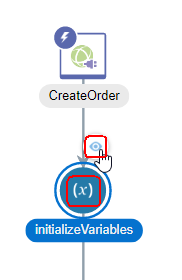

# Lab 100: Explore Oracle Integration Cloud

---

## Objective

- Explore Integration Cloud Service (OIC) to become familiar with its service console and functionality.

## Required Artifacts

- The following lab
- Oracle Public Cloud account that will be supplied by your instructor

## Introduction

This is the first of several labs that are part of the **OIC Development** workshop. 

In this lab, we will explore the main parts of Integration Cloud Service (ICS) which is a core component of Oracle Integration Cloud (OIC).  You will acquire a good overview of Oracle Integration Cloud (OIC), the next generation integration platform. You will explore various consoles and tools available to interact with your integration. The exercise will get you familiar with all the tooling available to work with this cloud service. 

We’ll look at the following:
1.	Oracle Cloud Services Dashboard
2.	OIC Designer User Interface
3.	OIC Monitoring User Interface

Let’s start by logging into the Oracle Integration Cloud and explore OIC Dashboard

## 1.1: Explore the Oracle Integration Cloud Dashboard

### **1.1.1**: Login to your Oracle Cloud account

---

**1.1.1.1** From your browser (Firefox or Chrome recommended) go to the following URL:
<https://cloud.oracle.com>

**1.1.1.2** Click _Sign In_ in the upper right hand corner of the browser
**IMPORTANT** - Make sure `Cloud Account with Identity Cloud Service` is selected Under Cloud Account, Enter **Cloud Account Name** provided by your instructor and Click on `My Services >` 

**1.1.1.3** Enter your `User Name` and `Password` and click **Sign In**

***NOTE:*** the **User Name and Password** values will be given to you by your instructor.

  

**1.1.1.4** You will be presented with a Dashboard displaying the various cloud services available to this account.

**NOTE:** The Cloud Services dashboard is intended to be used by the *Cloud Administrator* user role.  The Cloud Administrator is responsible for adding users, service instances, and monitoring usage of the Oracle cloud service account.  Developers and Operations roles will go directly to the service console link, not through the service dashboard.

**1.1.1.5** The Service Administrator can also look at Billing and Monitoring Meter OIC to understand how the service is being consumed by your Enterprise

**1.1.1.6** Selecting `View Details` link will take you to the Service Overview page where there are links for Billing and Monitoring Services. As this is a demonstration account, there is no Billing and Monitoring information available.

**1.1.1.7**  To get to Oracle Integration Cloud (OIC) service console where you will work on developing the integration, click on the `Open Service Console`. This will display OIC Service Instance Page listing all OIC Services provisioned in the Cloud Account.

**1.1.1.8**  Click on the Hamburger menu for OIC Instance `j2cOICpcs` and Select the `Open Integration Cloud Home Page` link to go to the OIC Welcome Page.  

 

**NOTE:** If you get an **Authentication Required** Pop-Up Window to re-enter user credentials, select `Cancel` to continue. 

**1.1.1.9**  Click on `Home` Link to go to OIC Home Page

 

**1.1.1.10**  Click on `Integrations` and you will now be presented with the Integration Service Console from which you will be performing the rest of this workshop lab.

 

You can click on `Connections` to go to the connections page and continue with Step **1.2.1.2:** below or follow instructions from step **1.2**

## 1.2: Explore the OIC Designer User Interface
---
**NOTE** If you want OIC users to go directly to OIC Home Page, you can bookmark the Home Page URL

OIC Integration Home Page - https://**OIC Instance URL**/ic/integration/home/faces/global

Open a new Browser Tab and enter **OIC Home Page URL** provided by your instructor

 

### **1.2.1:**	Explore OIC Connections

---

**1.2.1.1:** Select the `Connections` graphic in the designer portal

  

**1.2.1.2:** Make note of the connections that have been created. Notice that, among others, there are three connections, one called *eBusiness Suite OPERATIONS*, one called *On-Premises Oracle DB 12c* and the other called *Create Order*.

  

**1.2.1.3:** Note that the *On-Premises Oracle DB 12c* connector is using the OIC Connectivity Agent.  You can identify this by the note that it has an associated agent group.  This agent allows OIC to call on-premise systems.

 

*(More information about the OIC Connectivity Agent will be given later)*

**1.2.1.4:** Click on the `Create` button in the upper-right so we can see all the different OIC Connectors that are available.

**1.2.1.5:** Scroll through the list of connection types that are available in OIC:

**1.2.1.6:** Note that the icons with the plug are those that support the OIC Connectivity Agent for those service types which are not in the cloud, but on-premise, behind the company firewall.

**1.2.1.7:** When you are done browsing, select the “Cancel” button to dismiss the “Select an Adapter” dialog.

### **1.2.2:**	Explore OIC Integrations

---

**1.2.2.1** Select the `Hamburger` menu icon on top of the OIC Service Console to go to the `Designer` menu.

**1.2.2.2** Select the `Integrations` menu selection

**1.2.2.3** Select the `Hamburger` menu icon again to dismiss the left-hand navigation and get some screen real-estate back.
 
**1.2.2.4** Make note of the integrations that have been created. We will be working with the integration called *Lab 400 Create EBS Order Solution*.

  

**1.2.2.5** Open the integration `Lab 400 Create EBS Order Solution` by clicking on the integration name.  We want to see what it looks like.  Since the integration is already active, we’ll be looking at it in `Viewing` mode.  There will be a warning that _Edit is not possible..._ in yellow displayed along the top.  You can dismiss the warning bar by selecting the little "X" on the very right of the warning.

**1.2.2.6** You can see that this orchestration has many steps in it.  The view of the orchestration is *Zoom to Fit* in the browser real estate.  In order to get a closer view of the individual steps, you can either scroll with your mouse wheel to zoom in and out, or you can use the *-/+* slider in the top right of the designer.

**1.2.2.7** Try zooming in and out by using both methods.  

**1.2.2.8** If you get zoomed-in too close and want to pan, you’ll be able to move around the orchestration using the Pan window by clicking on the dark area and moving around.

**1.2.2.9** Select the `Start` icon and the drawing gets reset to a zoomed in view with the orchestration trigger at the very top.  This is a nice feature if you don't know where you are in a large orchestration.

   

**1.2.2.10** Try selecting the `Maximize` viewing control on the very right of the view control bar.  This will hide some of the detail on top of the screen to give the designer the most area to work in.  Hitting the `Maximize` button again will toggle that view.

**1.2.2.11** Let’s look at some of the components of the integration.  Select the `Maximize` view button again to restore the window.

**1.2.2.12** The component at the very top of the orchestration is the `Trigger`.  The trigger is representative of the connector that’s sending data into the integration.  It is highlighted with a little lightning bolt signifying an incoming event.

**1.2.2.13** If you hover over the Trigger node, you can see the details.  Our trigger is a SOAP connector type.  It is called *CreateOrder* and it is using the connection named *Create Order* that we looked at before in the Connection section of the OIC Designer.

**1.2.2.14** If you click on the Trigger, a pop-up will appear with a view icon in the shape of an eye.  Select the little eye so we can walk through the wizard that was used to setup the SOAP trigger.

**1.2.2.15** After the wizard initializes, you’ll be shown the basic information about the trigger – it’s name and description.

**1.2.2.16** Select the `Next` button to see the `Operations` that were configured for this SOAP Trigger.  Details like the Port Type, Operation, and request and response objects are shown.  In our case, no special SOAP headers were needed so that was set to `No`.

**1.2.2.17** Select the `Next` button to see the `Headers` configuration.  We didn't select to add any special headers, so the default of _No_ is shown.

**1.2.2.18** Select `“Next` again to see the `Summary` of the Trigger’s configuration.  The SOAP WSDL was uploaded to OIC when the connection was first configured, not in the wizard to configure the Trigger.

**1.2.2.19** Select the `Close` button to dismiss the Trigger view wizard.

**1.2.2.20** Let’s view the next node down in the integration.  This is an *Assign* node.  The job of this Assign activity is to initialize variables that will be used in the calls to be made to the eBusiness Suite.

**1.2.2.21** The variables defined in this Assign activity are view only.  Later on in this lab, we’ll de-activate the integration and all the values will be changeable.  These variables are constants that are needed for the EBS API call for creating an order.  You can see that variables such as the *EBS_Responsibility*, *EBS_Application*, *EBS_SecurityGroup*, and *EBS_OrgID* are needed.  Using variable rather than hard-coding these in the mapping for the adapter is preferable because they can be re-used across multiple EBS adapter invocations if necessary.

**1.2.2.22** Select the `Close` button in the upper-right to go back to the view of the orchestration.

**1.2.2.23** Back in the view of the orchestration we want to explore some of the nodes toward the bottom.  You can pan directly in the design window by clicking & holding the mouse button down in the background of the design palette, then you can pan up and down.

**1.2.2.24** Pan down to the map called `createEBSOrder`.  Click on this map activity and select the view icon.  We are going to see the values that are mapped into EBS.

**1.2.2.25** This is the most complex mapping in this integration because the EBS API we’re leveraging has thousands of attributes that can be passed.

**1.2.2.26** What you’ll see in the mapper is the possible input variables on the left and the EBS inbound variables that can be mapped to on the right.  The values that have been mapped are shown to the right of the EBS inbound variables in the mapper.

**1.2.2.27** In order to simplify this view, we want to `Filter` the Target variables.  Select the `Filter` button above the Target section and then select the radio button labeled `Mapped`, then select the `Apply` button.

**1.2.2.28** Now we only see variables in the Target that have been mapped from a Source variable.  If you want to get a visual depiction of where a Target variable has been mapped from, select the little green checkbox to the very left of the Target variable.  This will make a line visible from the Source variable to the Target.

**1.2.2.29** Note that the icon next to the `P_LINE_TBL_ITEM` has a double bar on top of it.  This indicates that it is a variable that can have multiple values in it (an array).  The OIC mapper automatically adds the `for-each(Lines)` function to that mapping so all possible order lines passed in from the Source will be mapped to the EBS adapter’s invocation.

**1.2.2.30** Once you are done exploring this complex OIC map, select the `Close` button in the upper-right to return back to the OIC orchestration.

**1.2.2.31** One last orchestration node we want to explore is one of the *Database Adapter* invocations.  Click on the database adapter call just above the `createEBSOrder` which is called `lookupAccountID`.   When you click on the little eye icon to view it, the DB Connector wizard will initialize.

**1.2.2.32** Along with the basic information about this invoke activity like the name and description, you can see that this connection is being used to execute a SQL query on the EBS database from OIC.  Select the `Next` button after reviewing the "Basic Info" screen.

**1.2.2.33** The SQL query being run can be examined.  This query is joining together 6 tables to provide the shipping information needed to create the EBS order for the customer. Select the `Next` button after reviewing the "Run a SQL Statement" screen.

**1.2.2.34** Select the `Close` button now that we have seen the SQL used in the Database Adapter invocation to the EBS Oracle Database.

- Note that OIC also has Database adapters for *MySQL*, *DB2*, and *SQL Server*.

**1.2.2.35** We’ve spent a lot of time exploring the `Lab 400 Create EBS Order SOlution` integration.  Let’s move on and explore the Agent setup.  Select the `Close` button in the upper-right to navigate back to the OIC Designer.

### **1.2.3:** Explore OIC Agents

---

**1.2.3.1** Select the `Hamburger` menu icon on top of the OIC Service Console to go to the `Designer` menu.

**1.2.3.2** Select the `Agents` menu selection

**1.2.3.3** Make note of the agent that has been created to communicate with the Database instance called *On-prem Agent Group*.

  

**1.2.3.4** Selecting the `1` shows the on-premise connectivity agent that is registered with the *On-prem Agent Group* agent group.  Select the little `i` (information) icon next to the Agent number can be select to see details.

**1.2.3.5** The agent identifier along with the OIC version is shown in the details.  You can also remove the agent by selecting the `X` to the right of the dialog. Click on the `X` so you can see the connections that are currently associated with this agent.

**1.2.3.6** You can see that both the *On-Premises Oracle DB 12c* and *User03 Oracle DB 12c* OIC Connectors are both using this agent so you can’t just remove it without first removing the references to it in those connections.

- Select the `Close` button _twice_ to dismiss the `“Agent Is In Use` and `Agent` dialogs.

**1.2.3.7** The Connectivity Agent is available from the `Download` pull-down on the Agent page shown below:

**1.2.3.8** The `Execution Agent` that you see in the download dropdown is a version of OIC that can run on-premise behind the customer firewall.  You can use OIC both in the cloud and on-premise for creating integrations.

## 1.3: Explore the OIC Monitoring User Interface

### **1.3.1:**	Open OIC Monitoring Console

---

**1.3.3.1** Select the `Hamburger` menu icon on top of the OIC Service Console to go to the `Monitoring` menu.

**1.3.3.2** Select the `DESIGNER` menu selection at the top to go back to the main left-hand navigation menu level.

**1.3.3.3** Next, select the `Monitoring` menu selection to go the OIC monitoring capabilities.

**1.3.3.4** Next, select the `Dashboards` selection to go to the main OIC monitoring dashboard page.

### **1.3.2:**	Explore OIC Monitoring Console - Dashboard

---

**1.3.2.1** You will be presented with the OIC Monitoring Dashboard.  Observe the various data that is available from this dashboard such as *% of successful messages*, *# of Currently Used Connections*, etc.

  

**1.3.2.2** On the right side of the `Dashboard` there are links where you can view the `Activity Stream`, Download the logs, and Download an Incident if a service request needs to be raised.

**1.3.2.3** Click on the Activity Stream link

**1.3.2.4** You will be directed to the `Integration` screen where you can view a summary of all messages that have passed through OIC in a tabular form.

**1.3.2.5** In the `Activity Stream` you can see the steps in the *Create EBS Order* integration that were executed and whether or not they were successful.

### **1.3.3:**	Explore OIC Monitoring Console - Logfiles

---

**1.3.3.1** In order to see the details of the payload that passed through the OIC integration, you need to download the Activity Stream Log from the `Download Logs` link on the right of the Activity Stream.

**1.3.3.2** Select the `Download Activity Stream` link and then save the zipfile to a location on your workstation such as *C:\temp* (Windows path)

**1.3.3.3** A downloading informational message will be shown with a blue background at the top of the page.  You can dismiss it by selecting the "X" at the right of the message bar.

**1.3.3.4** Extract the zipfile and you’ll see that there are 2 directories of logfiles – this is because the OIC instance is running on a cluster of 2 servers for high availability.

**1.3.3.5** Navigate into one of the server directories and examine the `OIC-flow.log` file in your favorite text editor.

**1.3.3.6** Here is a view of the end of the *OIC-flow.log* file in the *Notepad++* text editor showing the response given by EBS of the order payload after a successful execution of the create order API call:

**1.3.3.7** This logfile is helpful for investigation during development or runtime analysis.  The capture of the runtime payloads can be turned on or off during activation of the OIC integration where you are prompted whether or not you want to save the payloads.

### **1.3.4:**	Explore OIC Monitoring Console - Integrations

---

**1.3.4.1** Back in the OIC Monitoring console, select `Integrations` from the left-hand navigation.

**1.3.4.2** Note that all the statistOIC of the _Lab 400 Create EBS Order Solution_ are shown.

### **1.3.5:**	Explore OIC Monitoring Console - Agents

---

**1.3.5.1** Now, select `Agents` from the left-hand navigation.

**1.3.5.2** From the `Agents` monitoring console, you’ll be able to see if the OIC Connectivity Agent is up or down.  The green *sun* or *light* icon indicates that the Connectivity Agent is running fine.

### **1.3.6:**	Explore OIC Monitoring Console - Tracking

---

**1.3.6.1** Select the `Tracking` link in the navigation bar on the left

**1.3.6.2** The OIC `Tracking` monitor page shows all integration flows that have been executed.

**1.3.6.3** Select the chevron just to the right of the *Tracking* label at the top of the page to change the granularity of the Tracking report to `Last 6 Hours`

**1.3.6.4** Next, drill into a `COMPLETED` integration flow by selecting the integration name.

**1.3.6.5** We can now see that all steps in the this OIC integration flow were successful because the arrow is green highlighting all the orchestration flow steps.

**1.3.6.6** Select the `Close` button to go back to the OIC monitoring page.

**1.3.6.7** We are now done exploring the OIC monitoring features.

You now have used Oracle Integration Cloud Service to explore an integration to an On-Premise Oracle Database as well as Oracle EBS. 

You have now completed Lab 100 of the OIC Developer Workshop. In the next lab, we are going to build a 'hello world' echo service.

- This Lab is now completed.
