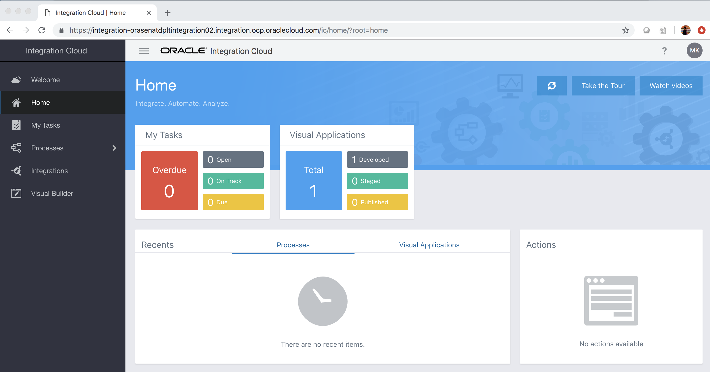
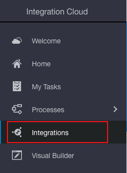
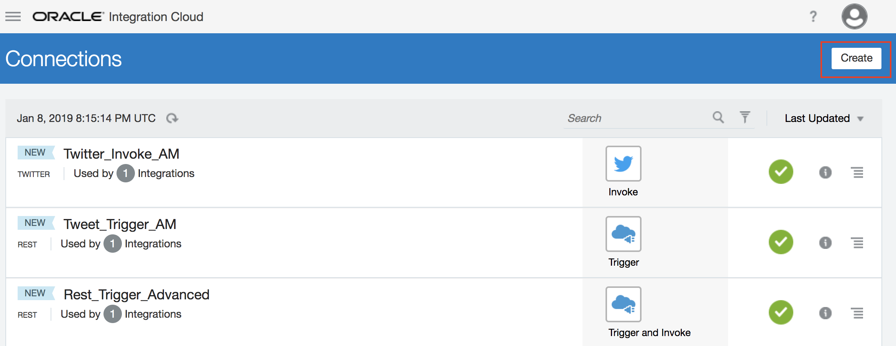
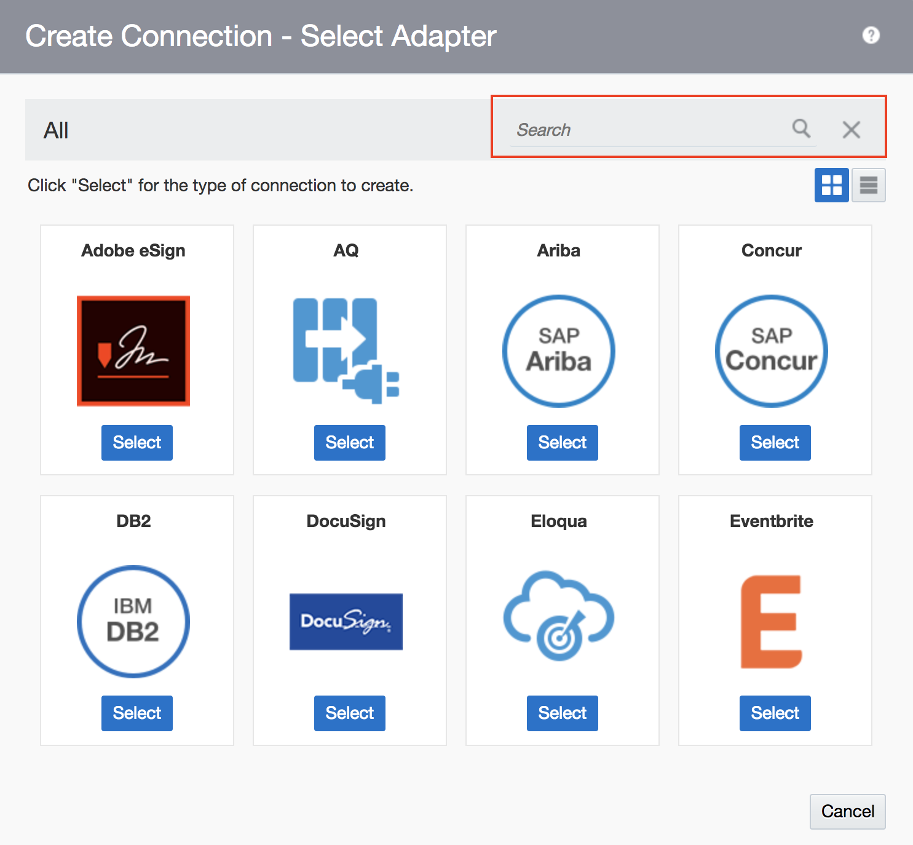
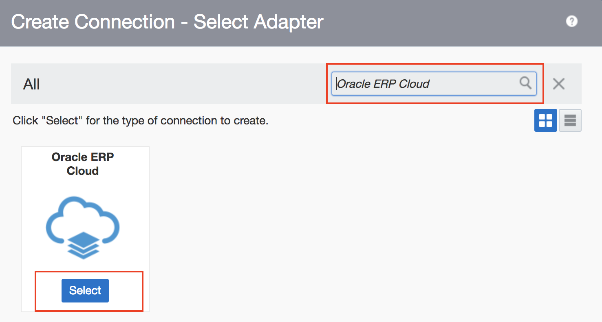
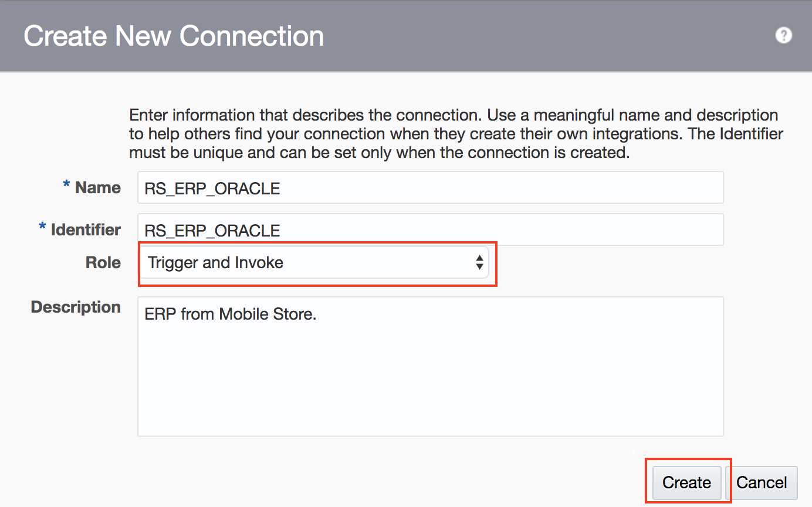
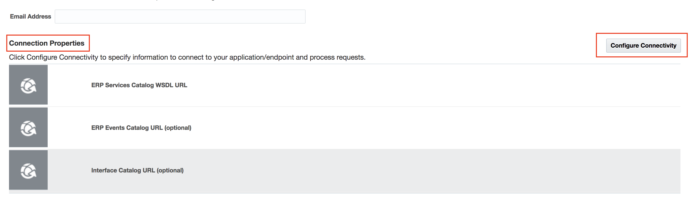
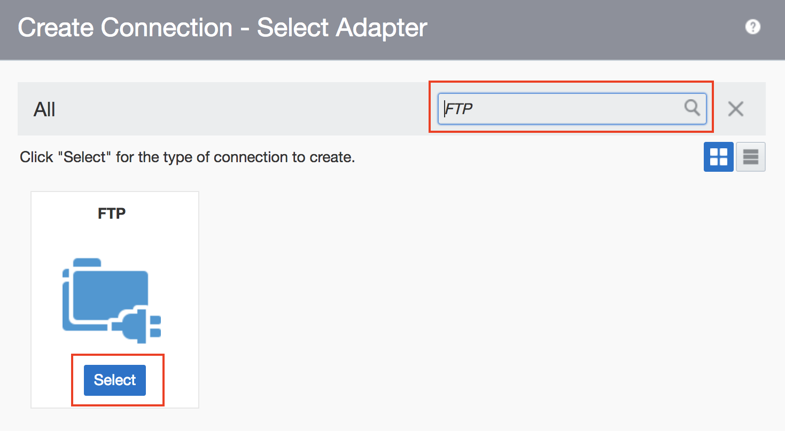
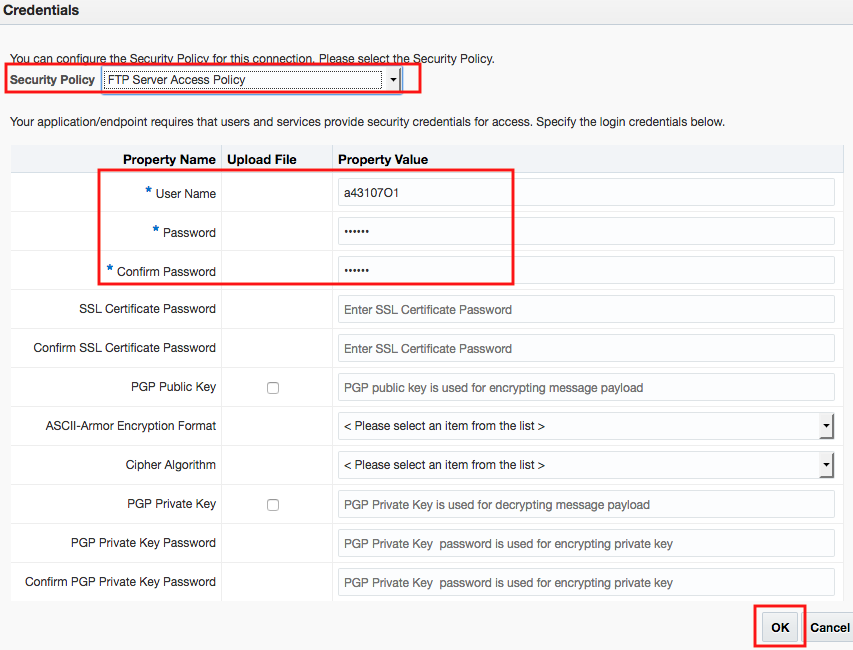
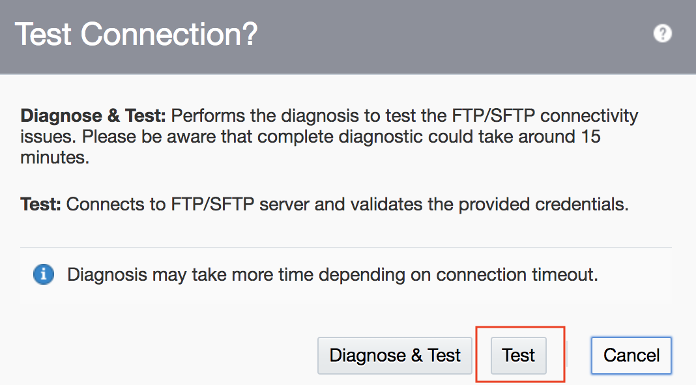

# Lab 300: Fusion SaaS Application Setup (ERP Adapters)

## Introduction

In this Lab we are going to review the configuration steps on Fusion SaaS applications (ERP, HCM, CRM etc.) to enable connectivity through OIC Fusion SaaS Adapters.

---

## Objectives

Configure connections for the following Fusion SaaS application adapters:

- ERP
- FTP
- HCM
- Sales Cloud
- Service Cloud

## Required Artifacts

- The following lab
- Oracle Public Cloud account that will be provided by your instructor

## 1.1 Configure ERP Adapter
#### 1.1.1: Go to the Oracle Integration Cloud Home Page

#### 1.1.2: Select **_Integrations_** from the Left Handside Menu

#### 1.1.3: Select **_Connections_** from the Left Handside Menu under **_Designer_**

#### 1.1.4: Click on **_Create_** from the Right Top Corner 

#### 1.1.5: Type ERP in the **_Search_** box on the Top Right and Select **_Oracle ERP Cloud_** from the Dropdown List

You can explore all the list of Oracle and third party adapters available.

#### 1.1.6: Click on **_Select_**

#### 1.1.7: Enter Connection information and click **_Create_**

_NOTE_: Select **_Trigger and Invoke_** under **_Role_**.

You should see a message at the top stating that your connection was created successfuly. Close the message by clicking 'X'.

#### 1.1.8: Click on **_Configure Connectivity_** under **_Connection Properties_**

#### 1.1.9: Provide the ERP Services Catalog WSDL URL and Click OK

#### 1.1.10: Click on **_Configure Security_** under **_Security_**

#### 1.1.11: Enter your OIC Instance Credentials and Click OK

#### 1.1.12: Click on **_Test_**

Make sure you get the message below stating that your connection was tested successfully, and that it shows _100%_. Close the message.

#### 1.1.12: Click on **_Save_** then **_Close_**

_NOTE_: Make sure you **save** before closing.

---

## 2.1 Configure FTP Adapter

#### 2.1.1: Click on **_Create_** from the Right Top Corner 

#### 2.1.2: Type FTP in the **_Search_** box on the Top Right and Select **_FTP** from the Dropdown List

#### 2.1.3: Enter Connection information and click **_Create_**

_NOTE_: Select **_Trigger and Invoke_** under **_Role_**.

You should see a message at the top stating that your connection was created successfuly. Close the message by clicking 'X'.

#### 2.1.4: Click on **_Configure Connectivity_** under **_Connection Properties_**

#### 2.1.5: Provide the FTP Server Host Address and FTP Server Port

_NOTE_: select 'yes' under the  SFTP connection dropdown.

#### 2.1.6: Click on **_Configure Security_** under **_Security_**

#### 2.1.7: Enter FTP Server Credentials and then click gOK

#### 2.1.8: Click on **_Test_**
 

#### 2.1.9: Select **_Test_**

Make sure you get the message belowgi stating that your connection was tested successfully, and that it shows _100%_. Close the message.

#### 2.1.10: Click on **_Save_** then **_Close_**

_NOTE_: Make sure you **save** before closing.

---

You now have used Oracle Integration Cloud to onfigure connections for multiple Fusion SaaS application adapters.

You have now completed Lab 300 Fusion SaaS Application Setup (ERP Adapters). In the next lab, we are going to create an integration flow listens to events in Oracle Sales Cloud.
 - This Lab is now completed.