# Lab 400: Oracle Sales Cloud (Events) - Account to Organization 

### Introduction

In this Lab we are going to create an integration flow that listens to events in Oracle Sales Cloud. OSC events will trigger an integration flow, for example, an account created in Sales Cloud is used to create an organization in Service Cloud.

### Acquire an Oracle Cloud Trial or Workshop Account

- Please click on the following link to create your <a href="https://cloud.oracle.com/tryit" target="_trial">Free Account</a> and complete all the required steps to get your free Oracle Cloud Trial Account. When you complete the registration process you'll receive a $300 credit that will enable you to complete the lab for free.  Additionally, you'll have 1000s hours left over to continue to explore the Oracle Cloud.
  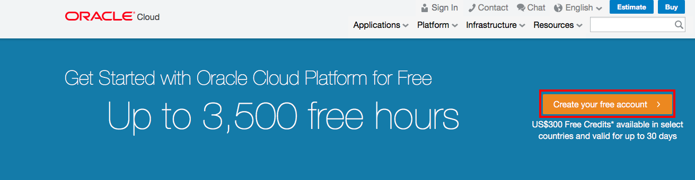
  
> NOTE: Soon after requesting your trial you will receive the following email.

- After your cloud account is ready, log into your account and navigant to the Integration cloud.

### STEP 1: Configure the Connection to Oracle Sales Cloud 

1. On the Integration Home page, click the hamburger menu at left and choose the Connections icon
 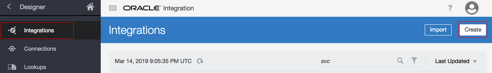
 
2. On the Connections page, search for Oracle Sales Cloud and click on it for more details
 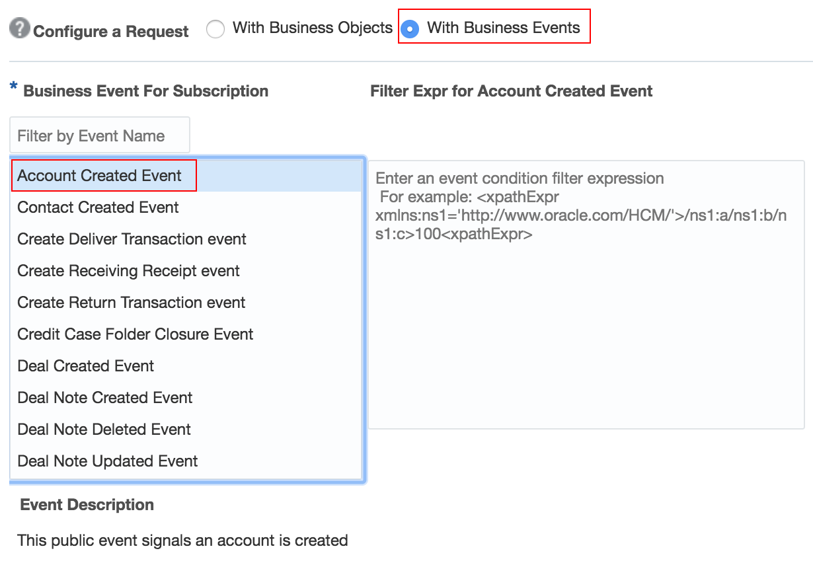

3. Click the Configure Connectivity button and in the Connection Properties window, enter the values of Sales Cloud
 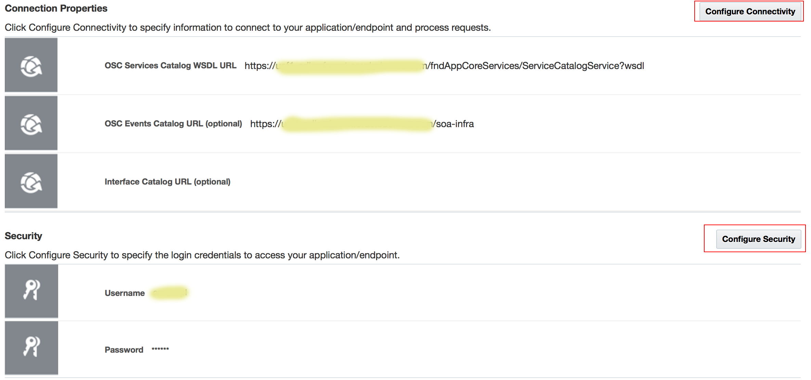

4. When you finish, click OK
 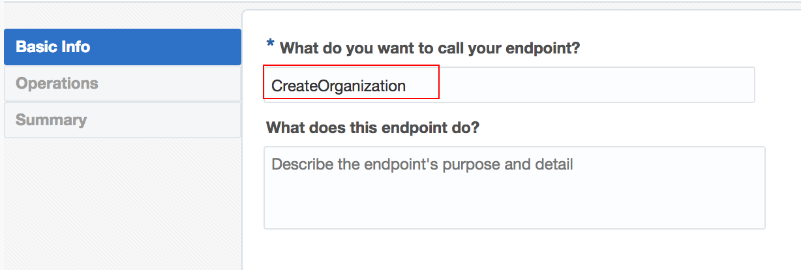

> OSC Service Catalog WSDL URL Example: https://<common domain host>/fndAppCoreService/ServiceCatalogService?wsdl

> OSC Event Catalog URL Example: https://CRM domain host>/soa-infra

5. Click the Security Configuration button, and in the Credentials window, enter the LogIn Credentials:
 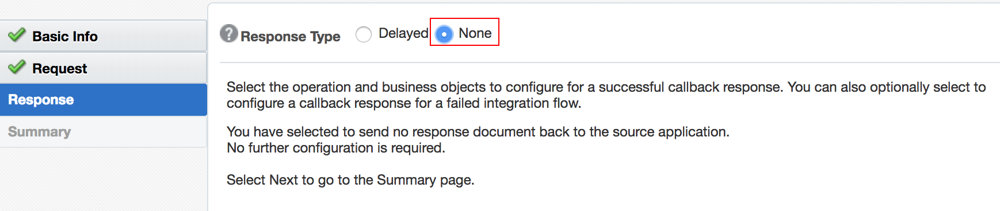
 
6. Click the Test icon on the Oracle Integration Cloud Service Connection Configuration page
 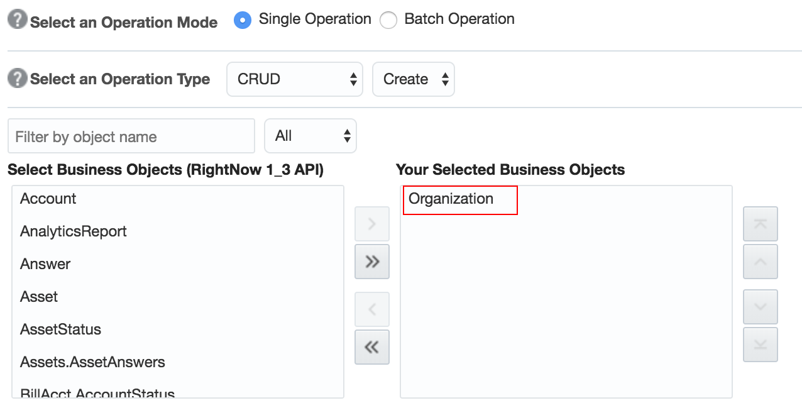

7. When the status meter shows 100% Complete, click Save
 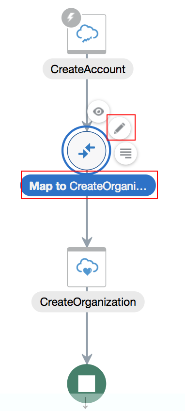
 
8. Click the Exit button
 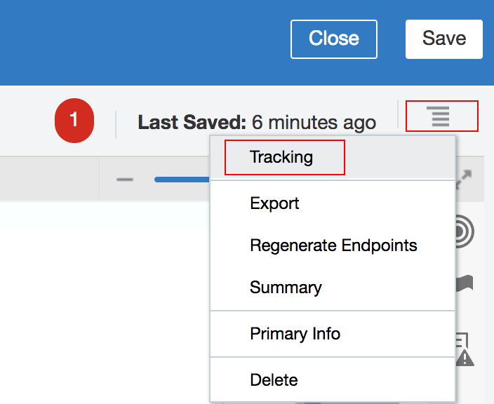

### STEP 2: Configure the Connection to the Oracle Service Cloud Instance

After configuring the connection to the Oracle Sales Cloud instance, you then configure the connection to the Oracle Service Cloud instance.

1. On the Connections page, search for Oracle Service Cloud and click it for more details
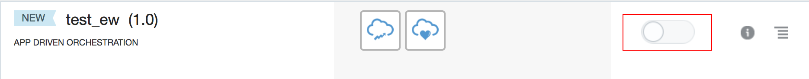

2. Click the Configure Connectivity button and in the Connection Properties window, enter the values of Service Cloud
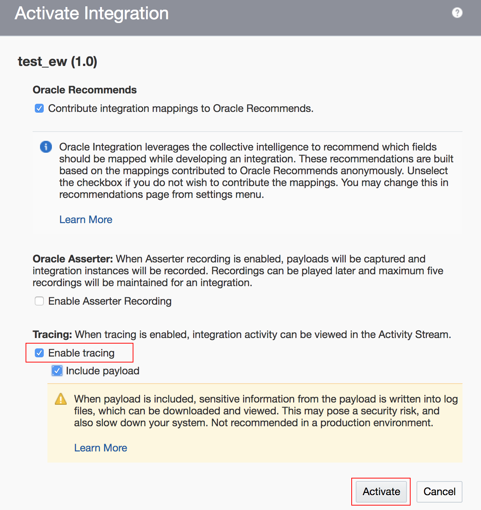
3. when you finish, click OK
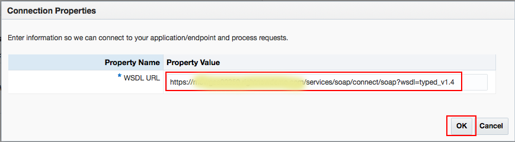

4. Click the Security Configuration button, and in the Credentials window, enter the LogIn Credentials:
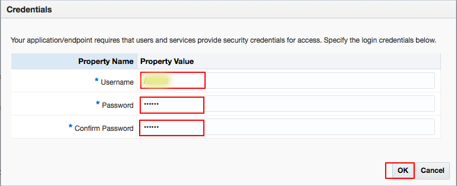

5. Click the Test icon on the Oracle Integration Cloud Service Connection Configuration page
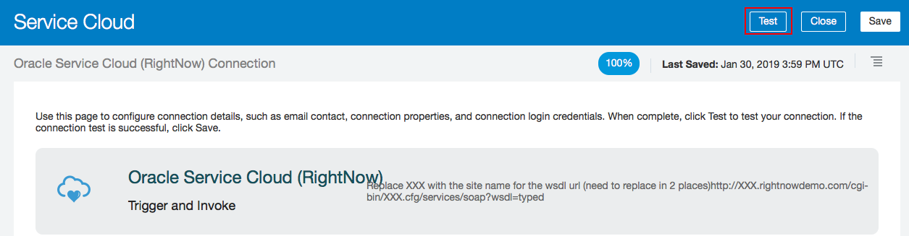

6. When the status meter shows 100% Complete, click Save and Exit
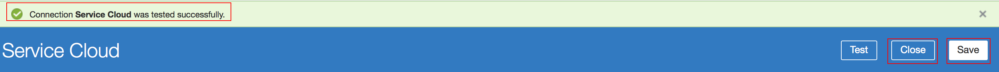

### STEP 3: Create the Orchestration Integration

1. Navigate to the Integration tab under Designer, and click on **Create** located on the top right

2. Select the **App Driven Orchestration** style 

3. Give the new integration a proper name and description as needed

4. A blank canvas will appear and you can drag the Sales Cloud connections here

5. In this step, we try to create an **Account** on Sales Cloud 
1) Provide the name you want to call 
2) Request: **With Business Events**
3) Business Event: **Activity Created Event**
4) Click on **Next**
5) Response Type: **None**

> Your Trigger is done!

6. Next, we add the Service Cloud Connection 
1) Provide the name you want to call
2) Operation Mode: **Single Operation**
3) Operation Type: **CRUD  Create**
4) Business Object: **Organization**
5) Click on done!

7. Now, we will do the mapping by clicking the pencil icon

8. Map the **OrganizationName** under **getAccountResponse** to **Name** under **Organization**, then **Validate**

9. Click on the hamburger menue on the top right and choose **Tracking**

10. Drag one indicator to the Tracking Field

11. Save and Close it

12. Now it's time to activate your integration before it can use. Remember to check the **Enable tracking**

## STEP 4: Test the Integration 
> Now, you will log into the Sale Cloud account and create an account there. It will automatically generate an organization on Service Cloud.

1. 

You have now completed Lab 400 of the AIC SaaS Integration Workshop. In the next lab, we are going to create an integration flow that retrieves ATOM Feeds from Fusion HCM.

- This Lab is now completed.
