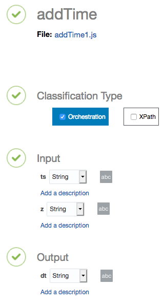
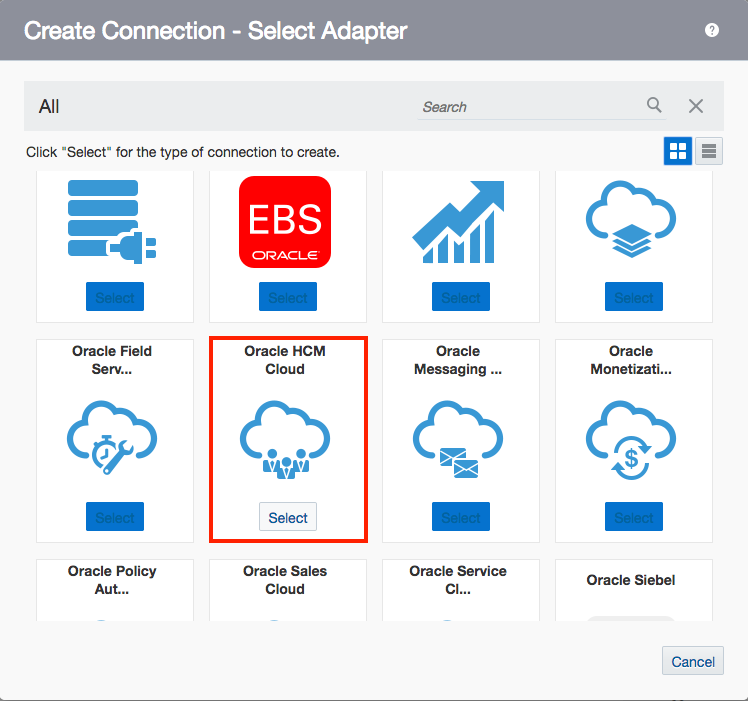
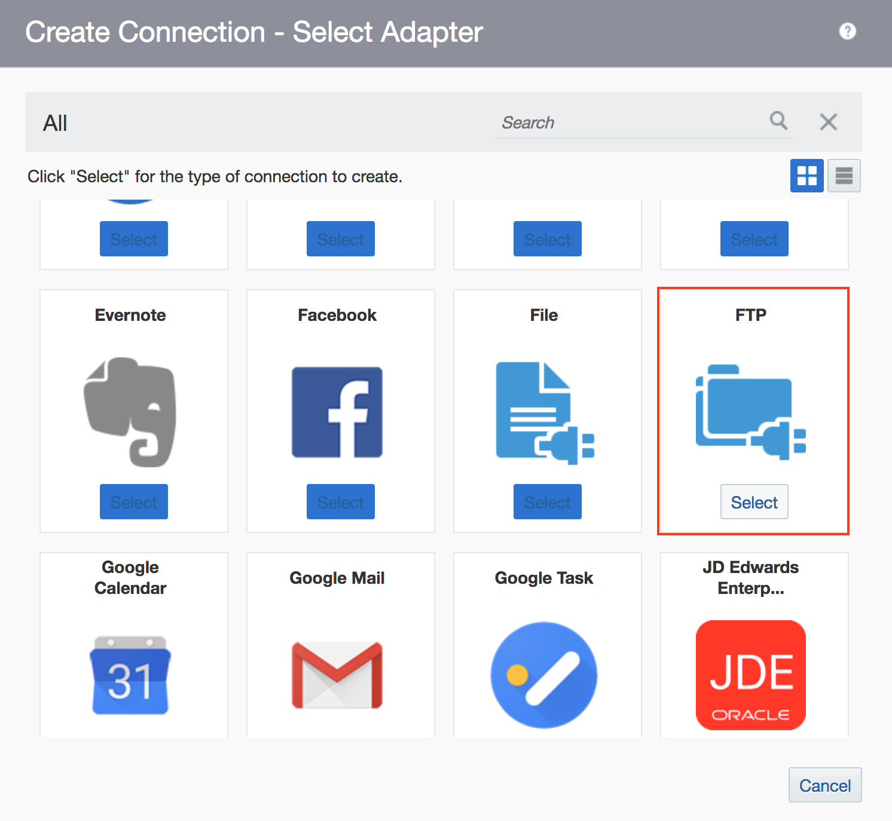

#  **Lab 500 - Part A: Oracle Integration Cloud (OIC) Development Workshop** 
> ***Last Updated: February 2019***  

Fusion HCM with ATOM Feeds Pre-Development Lab

## **Introduction**

> This lab is part of a series of **OIC Development** workshops created to provide users with hands-on experience building functional integrations in the cloud using Oracle Integration Cloud. In this lab, we will configure the connections and other parts of OIC that will be utilized in [Lab 500B](/ics500b.md). This lab assumes that you are already somewhat familiar with the OIC interface and logged into the instance.

## **Objectives**

> - To configure the Oracle Integration Cloud (OIC) environment in order to complete Lab 500B
> - Create the connections needed in the integration created in Lab 500B
> - Create a lookup function
> - Create an OIC library connection

## **Software Pre-Requisites**
This lab will provide you with the resources you will need to complete subsequent labs in this workshop

**For this lab you will need access to the following:**

1. Internet Connection
2. Web Browser
3. [DateTimeLib4.jar File](/images/500b/other_files/DateTimeLib4_1.0.jar)
4. Oracle Cloud Account with Integration Instance Provisioned
5. HCM enviornment details
6. SFTP server details

---

## **Recommended Web Browser**
Although most modern browsers are supported. We recommend using *Firefox or Chrome*
>If you are having issues with either browser, please clear your cookies or work in private browsing/incognito mode

---
# **Set-Up Required For Lab500B**

## **500a.1: Importing Add Time Function into OIC Library**

**500a.1.1**: From the OIC Home Page, Select the "Integrations" link to be redirected to the "Integration Designer" Page

  

**500a.1.2**: From the "Integration Designer" page, select the "Libraries" link

  
   
**500a.1.3**: To add a new library, click the Register button. A window will open where you will: browse and upload the .jar file given to you by your instructor and fill out the required fields then click the Create button
  

  

**500a.1.4**: You will be redirected to the configuration page where you will select the file name under the dropdown of the javascript file highlighted in red below
  

**500a.1.5**: The page will be populated with details to complete the configuration. Select the checkbox for Orchestration under Classification Type and the other fields should populate automatically

   ---> 
 

**500a.1.5**: Save, Close and move on to configuring the Scheduler Lookup

## **500a.2: Configure Scheduler Lookup**
**500a.2.1**: From the OIC Home Page, Select the "Integrations" link to be redirected to the "Integration Designer" Page

  

**500a.2.2**: From the "Integration Designer" page, select the "Lookups" link

 

 **500a.2.3**: To add a new lookup, click the Create button. A window will open where you will: browse and upload the .jar file given to you by your instructor and fill out the required fields then click the Create button 

  

  

**500a.2.4**: In this window, click on the "Domain_Name_1" link then click "Edit Domain Name" and name it with the single letter "A" and click OK then repeat with "Domain_Name_2" but name it the single letter "B"

> 
>

>      
>

>   

**500a.2.5**: In the first row listed, add the following values:

- _duration_ under column A and _10_ under column B

Then, click the plus sign  twice to add two rows

  

**500a.2.6**: In the next two row listed, add the following values:

- _emailalias_ under column A and 
_first.last@email.com_ under column B

- _pagesize_ under column A and _100_ under column B 

 

**500a.2.7**: Save and Close then move on to creating the connections
 

## **500a.3: Create Connections**

**500a.3.1**:  From the OIC Home Page, Select the "Integrations" link to be redirected to the "Integration Designer" Page

  

**500a.3.2**: From the "Integration Designer" page, select the "Connections" link

  

**500a.3.3**: To add a new connection, click the Create button. A window will open where you will see our library of pre-built adapters. Scroll or Search for the Oracle HCM Cloud adapter

 

 

**500a.3.4**: You will be redirected to a configuration page where you will first be prompted to fill out the required fields. Please use the naming convention depicted and you can leave the default role. Once completed, click the Create button.

 

**500a.3.5**: 
- Under the Connection Properties:
    - enter the WSDL URL 
        -  which typically follows this pattern: https://{***HcmInstanceBaseURL***}/fndAppCoreServices/ServiceCatalogService?WSDL

- Under the Security:
    - enter the username and password of the administrator on the instance 

 

**500a.3.6**: Once completed, save and test your connection. Once you are prompted with a success message, save once more and close. 

  

**500a.3.7**: To create the next connection, click the Create button. A window will open where you will see our library of pre-built adapters. Scroll or Search for the REST adapter

 

 

**500a.3.8**: You will be redirected to a configuration page where you will first be prompted to fill out the required fields. Please use the naming convention depicted and you can leave the default role. Once completed, click the Create button.

 

**500a.3.9**:
- Under the Connection Properties:
    - enter the connection type as **_REST API Base URL_**
    - choose **_TLSVersion_** 1.1
    - The **_Connection URL_** should just be the Base URL of the HCM instance

- Under the Security:
    - enter the username and password of the administrator on the instance 

 

**500a.3.10**: Once completed, save and test your connection. Once you are prompted with a success message, save once more and close. 

**500a.3.11**: To create the next connection, click the Create button. A window will open where you will see our library of pre-built adapters. Scroll or Search for the FTP adapter

 

 

**500a.3.12**: You will be redirected to a configuration page where you will first be prompted to fill out the required fields. Please use the naming convention depicted and you can leave the default role. Once completed, click the Create button.

 

**500a.3.13**: To configure the FTP Connection:
- Under the Connection Properties:
    - Enter the Server Host Address
    - Port (typically 22)
    - if SFTP, specify as such

- Under the Security Properties:
    - enter the username and password to access the server 

    OR
    - attach the associated private key

**500a.3.14**: Once completed, save and test your connection. Once you are prompted with a success message, save once more and close. 

# **NEXT STEPS:**
IN THE NEXT LAB YOU WILL GO ON TO BUILD THE FULL INTEGRATION DEPICTED BELOW:

 

# **Additional Resources**
 > [Oracle Adapters Documentation](https://docs.oracle.com/en/cloud/paas/integration-cloud/find-adapters.html)

--- 
# **THIS LAB IS NOW COMPLETED**