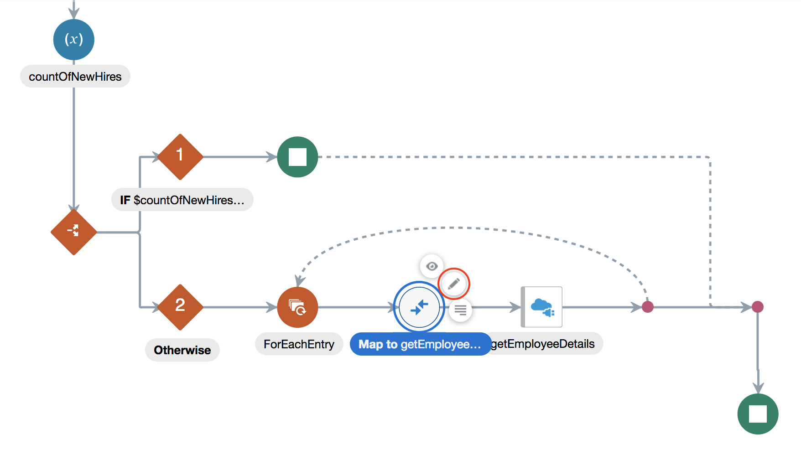

# **Lab 500 - Part B: Fusion HCM with ATOM Feeds**  

## **Objectives**

- Objective Needed

## **Introduction**

- Before we dive in and create the integration, we want you to get an understanding of the flow and the end result you are working to obtain from the integration flow. This lab will walk you through uploading the integration artifacts and testing the flow in Postman, and API testing tool.

## **Pre-Requisites**
 
- Workshop participant or lab instructor should have already completed Lab 500a

## **Getting Started**

**For this lab you will need access to the following:**

1. Internet Connection
2. Web Browser
3. Oracle Cloud Account with Integration Instance Provisioned
4. getEmployeeResponse.json
5. newEmployeeFile.csv

## **500b.1: Log in to the Oracle Integration Cloud Home Page and Nagivate to the Integration Designer Page**
**500b.1.1**: Navigate to the Home Page by using the OIC URL provided to you by your instructor. The URL should have the following pattern: 
https://{**InstanceName**}-{**CloudAccountName**}.integration.ocp.oraclecloud.com/ic/home/

**500b.1.2**: Log in using the IDCS re-route page

  

**500b.1.3**: From the home page, select *Integrations* and you should be auto redirected to the Integration Designer Page where you will see a list of the all the integrations available on the environment.


## **500b.2: Log in to the Oracle Integration Cloud Home Page and Nagivate to the Integration Designer Page**
  
  
  
  
  
  
  
  
  
  
  
  
  
  
  
  
  
  
  
  
  
  
  
  
  
  
  
  
  
  
  
  
  
  
  
  
  
  
  
  
  
  
  
  
  
  
  
  
  
  
  
  
  
  


--- 

# **THIS LAB IS NOW COMPLETED. PLEASE SEE YOUR INSTRUCTOR FOR FURTHER INSTRUCTIONS**
> In the next lab, we are going to use AIC Fusion ERP Adapter to process a Fusion ERP FBDI file and load the contents into Fusion ERP.

In this Lab we are going to create an integration flow that retrieves ATOM Feeds from Fusion HCM for processing, for example, New Hire ATOM Feeds.

```
You have now completed Lab 500 of the AIC SaaS Developer Workshop. 

- This Lab is now completed.


