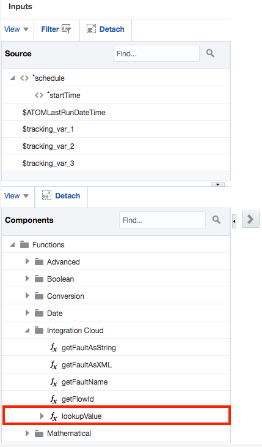
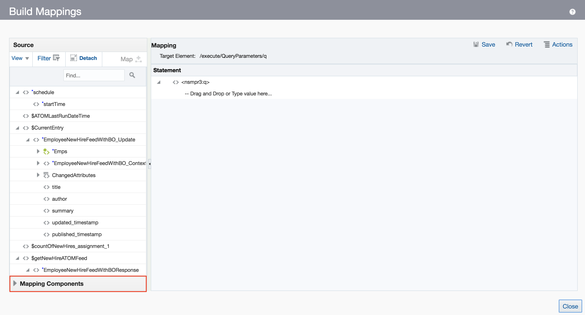

# **Lab 500 - Part B: Fusion HCM with ATOM Feeds**  

## **Objectives**

- Objective Needed

## **Introduction**

- Before 

## **Pre-Requisites**
 
- Workshop participant or lab instructor should have already completed [Lab 500a](/ics500a.md)

## **Getting Started**

**For this lab you will need access to the following:**

1. [Lab 500a](/ics500a.md) Completed
2. Internet Connection
3. Web Browser
4. Oracle Cloud Account with Integration Instance Provisioned
5. [getEmployeeResponse.json](/images/500b/other_files/getEmployeeResponse.json)
6. [newEmployeeFile.csv](/images/500b/other_files/newEmployeeFile.csv)

## **500b.1: Log in to the Oracle Integration Cloud Home Page and Nagivate to the Integration Designer Page**
**500b.1.1**: Navigate to the Home Page by using the OIC URL provided to you by your instructor. The URL should have the following pattern: 
https://{**InstanceName**}-{**CloudAccountName**}.integration.ocp.oraclecloud.com/ic/home/

**500b.1.2**: Log in using the IDCS re-route page

  

**500b.1.3**: From the home page, select *Integrations* and you should be auto redirected to the Integration Designer Page where you will see a list of the all the integrations available on the environment.


## **500b.2: Create a Scheduled Orchestration**
**500b.2.1**: From the Integrations Designer Page, Select Create and Choose the Integration style _App Driven Orchestration_
  

**500b.2.2**: Give the integration a name
 ***!!!!! ***

**500b.2.2**: Click on the schedule icon and select the pencil to edit the details


---> 
  

**500b.2.2**: 
- Name the Parameter: _ATOMLastRunDateTime_
- Enter the description as: _Last successful processed ATOM pull_
- Enter the value as: 2018-01-01T00:00:00.000Z

Once completed, close to be brought back to the main integration 

 

**500b.2.3**:  

 

 

**500b.2.4**: 


**500b.2.5**: Select the + Function button and select the addTime function listed in the menu. You will be redirected to a page with two parameters. On the first parameter labeled _ts_, click on the pencil then paste in the following to the expression builder: 
> **_concat(substring-before(/nssrcmpr:schedule/nssrcmpr:startTime,"."),".000Z")_**

Validate, Save, and Close.

**500b.2.6**: Click the pencil icon for the second parameter, _z_ to be redirected to the expression builder. In the Source panel, select and drag the **lookupValue** menu item from the Components>Functions>Integration Cloud menu into the expression builder. 

As a result, the Lookup Wizard will open.

  

The value for the parameter ‘srcValue is not filled….

/nssrcmpr: schedule


  
  
 


  
  
  
  
  
  
  
  
  
  
  
  
  
  
  
  
  
  
  
  
  
  
  
  
  
  
  
  
  
  
  
  
  
  
  
  
  
  
  
  
  
  


--- 

# **THIS LAB IS NOW COMPLETED. PLEASE SEE YOUR INSTRUCTOR FOR FURTHER INSTRUCTIONS**
> In the next lab, we are going to use AIC Fusion ERP Adapter to process a Fusion ERP FBDI file and load the contents into Fusion ERP.

In this Lab we are going to create an integration flow that retrieves ATOM Feeds from Fusion HCM for processing, for example, New Hire ATOM Feeds.

```
You have now completed Lab 500 of the AIC SaaS Developer Workshop. 

- This Lab is now completed.


