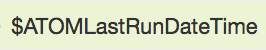
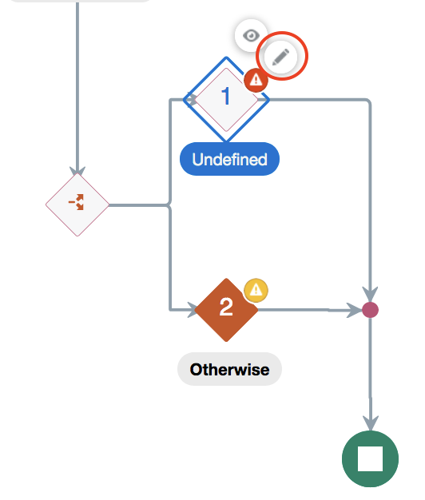
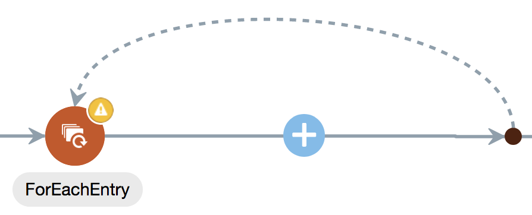
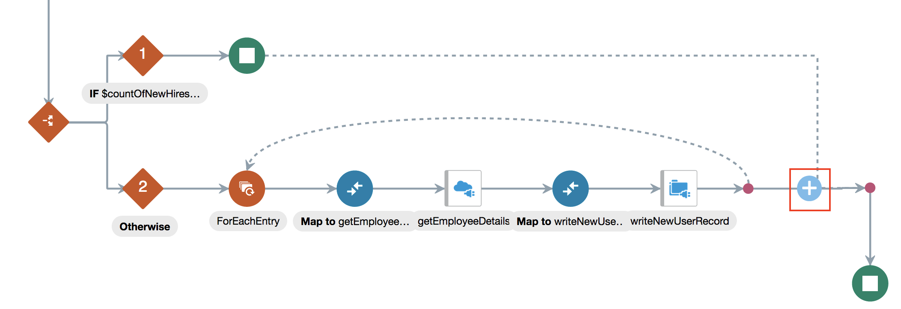
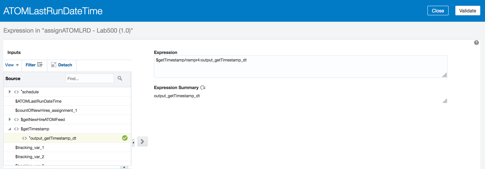

# **Lab 500 - Part B: Fusion HCM with ATOM Feeds**  
> ***Last Updated: February 2019***  

Fusion HCM with ATOM Feeds Development Lab

## **Introduction**

> This lab is part of a series of **OIC Development** workshops created to provide users with hands-on experience building functional integrations in the cloud using Oracle Integration Cloud. In this lab, we will build an integration that calls Fusion HCM to get employee details and writes those details to a file then uploads them to an SFTP server. The integration flow also retrieves ATOM Feeds from Fusion HCM for processing, in this case specifically for, New Hires.

## **Objectives**

- To Create a Scheduled Orchestration
- Gain familiarity with working with switch actions and for each loops in OIC
- Explore monitoring in OIC
- Explore ATOM feeds using Oracle's Fusion HCM

## **Pre-Requisites**
 
 - **REQUIRED:**

    - Workshop participant or lab instructor should have already completed [Lab 500A](/ics500a.md): Pre-Development for this Lab

 - **RECOMMENDED:**

    - Workshop participant should have already completed [Lab 100](/ics100.md): Explore Oracle Integration Cloud

## **Getting Started**

**For this lab you will need access to the following:**

1. Internet Connection
2. Web Browser
3. Oracle Cloud Account with Integration Instance Provisioned
4. [getEmployeeResponse.json](/images/500b/other_files/getEmployeeResponse.json)
5. [newEmployeeFile.csv](/images/500b/other_files/newEmployeeFile.csv)
6. Access to a Fusion HCM instance

## **500b.1: Log in to the Oracle Integration Cloud Home Page and Nagivate to the Integration Designer Page**
**500b.1.1**: Navigate to the Home Page by using the OIC URL provided to you by your instructor. The URL should have the following pattern: 
https://{**InstanceName**}-{**CloudAccountName**}.integration.ocp.oraclecloud.com/ic/home/

**500b.1.2**: Log in using the IDCS re-route page

  

**500b.1.3**: From the home page, select *Integrations* and you should be automatically redirected to the Integration Designer Page where you will see a list of the all the integrations available on the environment.

## **500b.2: Create the Scheduled Orchestration**
> ### ***Start the integration, set parameters, and call a function***

**500b.2.1**: From the Integrations Designer Page, Select Create and Choose the Integration style _Scheduled Orchestration_

  

**500b.2.2**: Give the integration a name. Please use the naming convention listed in the image below where XX is replaced by your initials

**500b.2.2**: Click on the schedule icon and select the pencil to edit the details

---> 
  

**500b.2.2**: Set the Schedule Parameters as listed below:
- Name the Parameter: _ATOMLastRunDateTime_
- Enter the description as: _Last successful processed ATOM pull_
- Enter the value as: 2018-01-01T00:00:00.000Z

Once completed, close to be brought back to the main integration 

 

**500b.2.3**: Add in the Call Function Action by clicking on the flag icon then dragging and dropping the Function Call Icon (found under the Data label) to the integration flow directly under the schedule icon

 

 

**500b.2.4**: Click on the Function Call icon to reveal the menu bubbles of which you click on the pencil to configure the function associated with the call

**500b.2.5**: On the config page:
- select the "_+ Function_" button and select the addTime function listed in the menu. 

You will be redirected to a page with two parameters. On the first parameter labeled _ts_, click the pencil then paste in the following to the expression builder: 
> **_concat(substring-before(/nssrcmpr:schedule/nssrcmpr:startTime,"."),".000Z")_**

  

Validate and Close

**500b.2.5b**: Click the pencil icon for the second parameter, _z_ to be redirected to the expression builder. In the Components panel, select and drag the **lookupValue** menu item (found under Components > Functions > Integration Cloud) into the expression builder

As a result, the Lookup Wizard will open.

  

**500b.2.5c**: Select SchedulerLookup from the list of available lookups and continue through the wizard

**500b.2.5d**: On the source column, select the value A and on the target column, select the value B. The values in the table rbelow will auto-populate

  

**500b.2.5e**: Finally, set the Default Value as 1 and click Done

> You will be prompted with a warning similar to _"The value for the parameter ‘srcValue' is not filled…"_ but it is ok to ignore.   
>
> ***In the expression builder, edit the expression by removing the srcValue, and replacing it with the following: _/nssrcmpr: schedule_***

Validate and Close to be brought back to the upper level screen where you should Validate and Close once more to be brought back to the main integration flow

 

## **500b.3: Adding the First HCM Connection**

**500b.3.1a**: To add the HCM Invoke to the flow:
- Hover over the line just after the _getTimestamp_ icon until the plus sign appears
- Click on the sign and search for then select your HCM Connection   (Note: please use the one made with the prebuilt adapter)
- You will be redirected to the configuration wizard where you will give the endpoint a name **(we suggest _getNewHireATOMFeed_)** and select the radio button _Subscribe to Updates (via ATOM Feed)_

 

**500b.3.1b**: Continue through the wizard and select the operation _Employee New Hire_, change the "Max Entries to Process" to 250, and continue through the wizard

  

**500b.3.2a**: Click on the mapping icon  to reveal the pencil then select the pencil icon to be redirected to the mapping 

**500b.3.2b**: There you will map _$ATOMLastRunDateTime_ from the source to _updated-min_ in the target by dragging and dropping the source over the target.
> You can also click on the target to enter the expression builder where you can complete the drag and drop action or enter data directly into the space

  --> 
 

**500b.3.3**: Validate and Close to be returned to the top level of the integration design then save your integration

## **500b.4: Assign a Variable**

**500b.4.1**: To assign a variable:

- Click on the flag icon 

  

- Drag and drop the Assign Icon (found under the Data label) to the integration flow directly under the _getNewHireATOMFeed_ icon

 --> 

**500b.4.2a**: A window will open where you will provide the action with a unique name _countOfNewHires_ and if you'd like a short description then click the Create button

  

**500b.4.2b**: On the config page set the following values:
- On the variable column, select counfOfNewHires_assignment_1 from the dropdown
- Set Data Type as string
- The description is optional: _Count the # of new employees returned_
- Select the pencil to edit the Value. In the expression builder you will drag and drop the EmployeeNewHireFeedResponse from the source

**500b.4.3**: Validate and Close to be returned to the top level of the integration design

## **500b.5: Add In a Switch Action and Configure the First Conditional**

**500b.5.1**: To add a conditional statement:

- Click on the flag icon 

  

- Drag and drop the Switch Icon (found under the Collection label) to the integration flow directly under the _countOfNewHires_ icon

  

 

**500b.5.2**: To configure the condition:

- Start by clicking on the icon in the first branch of the fork and click on the pencil icon to open the configuration

 

- Drag and drop _$countOfNewHires_assignment_1_ form the source panel to the expression builder
 
 -->
   

**500b.5.3**: Complete the branch by adding in a "Stop" action found under the action menu under the End menu item and save the integration

## **500b.6: Configure the Second Conditional by Adding a For Each Loop**

**500b.6.1**: To configure the second conditional:

- Click on the flag icon 

  

- Drag and drop the ForEach Icon (found under the Collection label) to the integration flow directly following the icon in the second branch of the fork

    

**500b.6.2**: Configure the loop by completing the fields in the window 
- Name: **_ForEachEntry_**
- Description is optional
- Repeating Element: drag and drop **_$EmployeeNewHireFeed_Update_** from the source to the field name
- Current Element Name: **_CurrentEntry_**

**500b.6.3**: Then Click Create to be returned to the main integration flow

## **500b.7: Adding the Second HCM Connection**

**500b.7.1**: To add the HCM Invoke to the flow:

- Hover over the line within the loop until the plus sign appears
- Click on the sign and search for then select your HCM Connection   (Note: please use the one made with the REST adapter)

  

**500b.7.2**: You will be redirected to the configuration wizard where you will: 
- Give the endpoint a name **(we suggest _getEmployeeDetails_)**
- Give the relative resource URI **_/hcmCoreApi/resources/latest/emps_**
- Set the action to perform on the endpoint as **_GET_**
- Check the boxes to add parameters and configure the response 

  

**500b.7.3**: For the request parameters, specify the query parameter as **_q_** with the data type **string**. Then, continue through the wizard 

  

**500b.7.4**: Set the response payload format as JSON Sample and upload the [Employee JSON](/images/500b/other_files/getEmployeeResponse.json) file provided

  

**500b.7.4**: Click on the mapping icon  to reveal the pencil then select the pencil icon to be redirected to the mapping 

  

**500b.7.5**: Under the Target panel, click into the Query Parameters dropdown item _q_ to open the expression mapping

  

  

**500b.7.6**: In the Source panel, expand the Mapping Components and drag and drop the concat function (Mapping Components > Functions > String > Concat) to the mapping statement

 

**500b.7.7**: On the first line, write in "PersonId=" and on the second line, drag and drop PersonId from the source panel which can be found under _$CurrentEntry_ > _EmployeeNewHireFeed_Update_ > _EmployeeNewHireFeed_Context_

  

**500b.7.8**: Save and Close then Validate and Close in the top level of the mapping menu and save at the top level of the integration

## **500b.8: Adding the SFTP Connection**

**500b.8.1**: To add in the SFTP Connection:
- Hover over the line just after the _getEmployeeDetails_ icon until the plus sign appears
- Click on the sign and search for then select your FTP Connection
- You will be redirected to the configuration wizard where you will give the endpoint a name **(we suggest _writeNewUserRecord_)** and continue through the configuration wizard

  

  

**500b.8.2**: On the _Operations_ window, select the operation to be _Write File_, select the radio button for the transfer mode to ASCII, write in an _Output Directory_ given to you by your instructor, and use the following for the _File Name Pattern_: newCandidateRecord%yyyyMMddHHmmss%.csv

  

**500b.8.3**: On the _Schema_ window, select the radio button YES to specify the file structure and choose _Sample delimited document (e.g. CSV)_ from the dropdown

  

**500b.8.4**: To define the file content structure:
- browse for and upload the [New Employee CSV](/images/500b/other_files/newEmployeeFile.csv)
- Enter the Record Name as: User
- Enter the Recordset Name as: NewUser
- Select the field delimeter as _Comma(,)_

  

**500b.8.4**: Map the following fields from the source (getEmployeeDetails response-wrapper from the second HCM connection) to the target (the CSV file):
> - Salutation
> - First Name
> - Last Name
> - Coorespondence Language
> - Person Number
> - DOB
> - UserName
> - WorkEmail
> - WorkerType

  

**500b.8.5**:  Validate and close then move on to completing the integration

## **500b.9: Assigning a Variable**

**500b.9.1**: To assign a variable:

- Click on the flag icon 

  

- Drag and drop the Assign Icon (found under the Data label) to the integration flow directly following the icon in the second branch of the fork

  

  

**500b.9.2a**: Name the action _assignATOMLRD_ and click the Create button

  

**500b.9.2b**: From the dropdown, select the schedule parameter _ATOMLastRunDateTime_ with data type string and click the pencil to enter the expression builder

  

**500b.9.2c**: From the source, drag and drop map _output_getTimestamp_dt_ ($getTimestamp >  output_getTimestamp_dt) to the expression box then, validate and close to be brought back to the configuration page

  

**500b.9.2d**: From the Configuration Page, review the details then, validate and close to return to the main integration design

  

**500b.9.3**: Save your integration

## **500b.10: Select a Business Identifier (BID)**

**500b.10.1**: At this stage, your integration should resemble the image below

  

**500b.10.2**: From, the hamburger menu , choose _Tracking_ to be brought to the BID config window

 

**500b.10.3**: Drag and drop the startTime item from the source to the first row of the label then save to be returned to the main integration

  

**500b.10.4**: Save and close your integration so we can activate and test it

## **500b.11: Activate and Run the Integration**

**500b.11.1**: From the list of integrations in the OIC designer page, find your integration and click the slider to activate the integration

  

**500b.11.2a**: In this menu, check the box to enable tracing

  

**500b.11.2b**: A new checkbox will populate under it, check that box to include the payload so that we can see the data flow on the monitoring page. Once completed, click Activate and wait for the page to load

  

**500b.11.3**: An activated integration turn the slider green. Select the hamburger menu  and select "Submit Now" from the dropdown

  

  

  

## **500b.12: Monitor the Integration and Viewing the ATOM feed**

**500b.12.1**: Now, navigate to the monitoring page by clicking on *< Designer* in the menu, select **_Monitoring_**, and in the **_Monitoring_** menu, select **_Tracking_**

 
--->
  
--->

> - If you click into the instance, you should see the following diagram with the green tracing
> - If you get an error, zero in on the red and view the Activity Stream that can be seen by clicking the hamburger menu  then, go back to that step in the directions and check against the guide. If you are still having issues, please contact your instructor
>
>   

**500b.12.2**: To view the ATOM feed...

--- 

# **THIS LAB IS NOW COMPLETED. PLEASE SEE YOUR INSTRUCTOR FOR FURTHER INSTRUCTIONS**
> In the next lab, we are going to use AIC Fusion ERP Adapter to process a Fusion ERP FBDI file and load the contents into Fusion ERP.