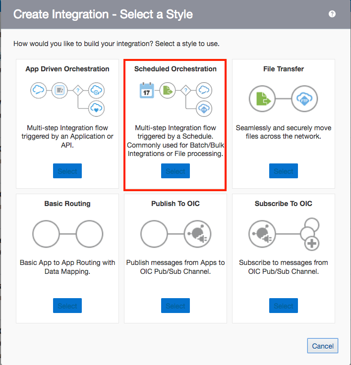
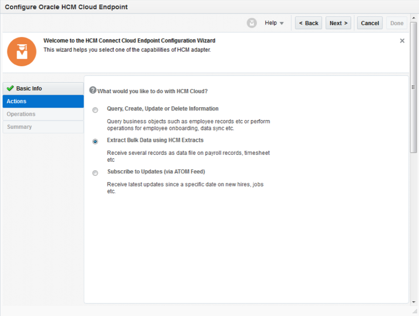
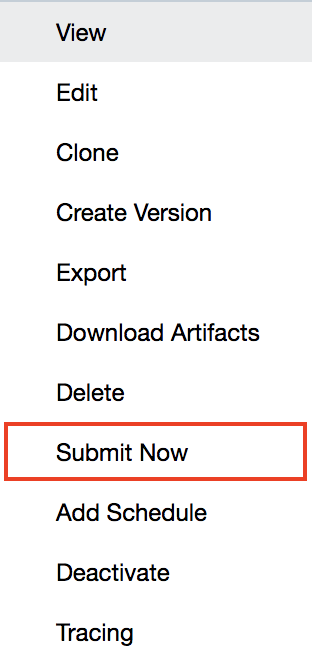
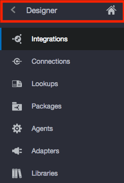

# **Lab 550 - Oracle Integration Cloud (OIC) Development Workshop**
> Last Updated: February 2019

New Hire Export using HCM Extract to FTP Integration

## **Introduction**

> This lab is part of a series of OIC Development workshops created to provide users with hands-on experience building functional integrations in the cloud using Oracle Integration Cloud. In this lab, we will create a schedule to retrieve a file published by Oracle Fusion HCM and then writes them to a file on an FTP server.

## **Objectives**

- To Create a Schedule Orchestration
- Explore HCM Extracts

## **Pre-Requisites**

- **REQUIRED:**
    - Workshop participants or lab instructor should have already completed [Lab 500A](/ics500a.md): Pre-Development for this lab

- **RECOMMENDED:**
    - Workshop participants should have already completed [Lab 100](/ics100.md): Explore Oracle Integration Cloud

## **Getting Started**

**For this lab you will need access to the following:**

1. Internet Connection
2. Web Browser
3. Oracle Cloud Account with Integration Instance Provisioned
4. Access to a Fusion HCM instance
5. Access to an FTP server

## **550.1: Log into the Oracle Integration Cloud Home Page and Navigate to the Integration Designer Page**

**550.1.1**: Navigate to the Home Page by using the OIC URL provided to you by your instructor. The URL should have the follwing pattern:
https://{**InstanceName**}-{**CloudAccountName**}.integration.ocp.oraclecloud.com/ic/home/

**550.1.2**: Log in using the IDCS re-route page

**550.1.3**: From the home page, select _Integrations_ and you should
automatically be redirected to the Integration Designer Page where you will see
a list of all the integrations available on the environment

## **550.2: Create the Scheduled Orchestration**

> ### **_Start the integration, set parameters, and call a function_**

**550.2.1**: From the Integrations Designer Page, select Create and choose the Integration style _Scheduled Orchestration_

**550.2.2**: Give the integration a name. Please use the naming convention listed in the image below where XX is replaced by your initials

**550.2.3**: Click on the schedule icon and select the pencil to edit the details

--->

**550.2.4**: Set the Schedule Parameters 
- On the empty **Parameter Name** row, click the **+** icon.
- Enter _schedule parameter DocumentID_ as the **parameter name**
- Enter _Last successful processed documentID_ as the optional **Description**
- Enter **0** in the **Value** column. This setting is the initial document identifier within HCM Universal Content Manager. After the first time the integration is run, this value will update to reflect the last successful document identifer

Once completed, close to be brought back to the main integration

## **550.3: Create getExtractFile (HCM Cloud Adapter)**

**550.3.1**: The next task in the integration is the retrieval of the HCM Cloud Extract file accessed via the HCM Cloud Adapter.

- In the right navigation pane, click **Invokes**
- Click **Oracle HCM CLoud**, then drag the HCM connection that you created in 500a to the **+** sign following the `Schedule` action.
The **Oracle HCM Cloud Adapter** configuration wizard is displayed

**550.3.2**: Enter `getExtractFile` in the **What do you want to call your endpoint?**

Click **Next**. This will display the **actions** tab.

**550.3.3**: Select the radial button for **Extract Bulk Data Using HCM Extracts**

Click **Next**. This will display the **Operations** tab.

**550.3.4**: Enter `Encrypted New Hire Export` for **What is the Integration Name for HCM Extract?**

The **Integration Name** is the value of the **Integration Name** from the HCM Extract Definition within HCM Cloud as highlighted in the following UI Screen.

 **550.3.5**:Click **Next**. This will display the **Summary** tab.

**550.3.6**: Click **Done**. This will return you to the integration canvas.

On the integration canvas two icons will have been added, one for the configured HCM Cloud Adapter (**getExtractFile**) and one for the **Map to getExtractFile**

## **550.4: Map to getExtractFile**

The newly added **Map to getExtractFile** represents the input value for the HCM Cloud Adapter. This can now be configured

**550.4.1**: Click the Mapper icon (Map to getExtractFile). Click **Edit** to
open the mapper.

**550.4.2**: Select the **$schedule\_parameter\_DocumentId** from the **Sources** section and drag it to the **lastProcessedDocumentId** **Target** field. This creates a link, with the last run daate and time becoming the input value for the ATOM feed action.

Click **Close**. This will return you to the integration canvas.

## **550.5: Add WriteFile2FTP (FTP Adapter)**

The next task in the integration is to write the file to the on-premises FTP server.

**550.5.1**: In the right navigation pane, click **Invokes**. Click **FTP**, then find the FTP connection we created in 500a. Drag the connection to the *+* sign following the **Map to getExtractFile** action. The **FTP Adapter** configuration wizard is displayed

**550.5.2**: Enter `WriteFile2SFTP` in the **What do you want to call this endpoint?** field.

Click **Next**. This will display the **Operations** tab.

**550.5.3**: Select the **Write File** value in the **Select Operation** drop down. 
- Select the **ASCII** radial selection for **Select a Transfer Mode**. 
- Enter the **Output Directory** value location based on your FTP folder structure configuration. 
- Enter `newCandidateRecord%yyyMMddHH%`.pgp for **File Name Pattern**. This will result in a file named `newCandidateRecord2019031808` for a file executed on March 18th, 2018.
- Select the **No** value for **Enable PGP Security**. This assumes the file being extracted is alread encrypted

Click **Next**. This will display the **Schema** tab.

**550.5.4**: Select **No** for **Do you want to specify the structure for the contents of this file?**

Click **Next**. This will display the **Summary** tab.

**550.5.5**: Click **Done**. This will return you to the integration canvas. This will add both a **WriteFile2SFTP** FTP Adapter action and a **Map To WriteFile2SFTP** icon to the integration

## **550.6: Map to writeFile2SFTP**

This map action will map the file from Integration to the customer on-premises FTP Server.

**550.6.1**: Click the Mapper icon (Map to WriteFile2SFTP) and then click **Edit** to invoke the mapper. Select the **FileReference** value under the ICSFile branch on the **Source** side of the UI and drag to the **Target** value of the **FileReference** under **ICSFile**. This represents the mapping of the extracted file from the **HCM Cloud Adapter** to the input of the write action of the **FTP Adapter**.

Click **Close**, returning to the integration canvas.

## **550.6: Add assignDocID**

The final step in defining the integration is to set the last document identifier. This will be used as the starting point for the `DocumentId` for the next call when the integration is executed.

**550.6.1**: In the right navigation pane, click **Actions**

  

- Drag and drop the Assign Icon (found under the Data label) to the integration flow directly under the `writeFile2SFTP` and before the **Stop** icon.

**550.6.2**: A window will open up where you will provide the action with a unique name of `assignDocID` and then click the **Create** button

**550.6.3**: On the config page set the folowing values:

- On the variable column, select **schedule\_parameter\_Document (Schedule Parameter)** in the Variable drop down.
- Set the Data Type as string
- Set the description as: _Set the Document ID of the last run_
- Select the pencil to edit the **Value**.

**550.6.4**: Select and drag the **documentID** under the **HCMDataExtractResponse** into the **Expression** field as illustrated.

Select **Close** and save your integration.

## **550.7: Select a Business Identifier (BID)**

**550.7.1**: At this stage, your integration should resemble the image below.

  

**550.7.2**: From the hamburger menu , choose _Tracking_ to be brought to the Business Identifier configuration window.

 

**550.7.3**: Drag and drop the startTime item from the source to the first row of the label then save to be returned to the main integration.

  

**550.7.4**: Save and close your integration so we can activate and test it.

## **550.8: Activate and Run the Integration**

**550.8.1**: From the list of integrations in the OIC designer page, find your integration and click the slider to activate the integration.

  

**550.8.2**: In this menu, check the box to enable tracing and include payload. Once completed, click **Activate** and wait for the page to load

  

**550.8.3**: An activated integration turn the slider green. Select the hamburger menu  and select "Submit Now" from the dropdown.

  

  

  

## **550.9: Monitor the Integration and View FTP Server**

**550.9.1**: Now, navigate to the monitoring page by clicking on the _<_ icon on at the top of the sidebar menu, selecting **_Monitoring_**, and in the **_Monitoring_** menu, select **_Runs_**

 
--->
  
--->

The dashboard should show one successful run of your integration.

**550.9.2**: Connect to the FTP server using your FTP Client and the credentials given to you by your instructor.

The folder should now contain the extract file from HCM.

---

# **THIS LAB IS NOW COMPLETED. PLEASE SEE YOUR INSTRUCTOR FOR FURTHER INSTRUCTIONS**
