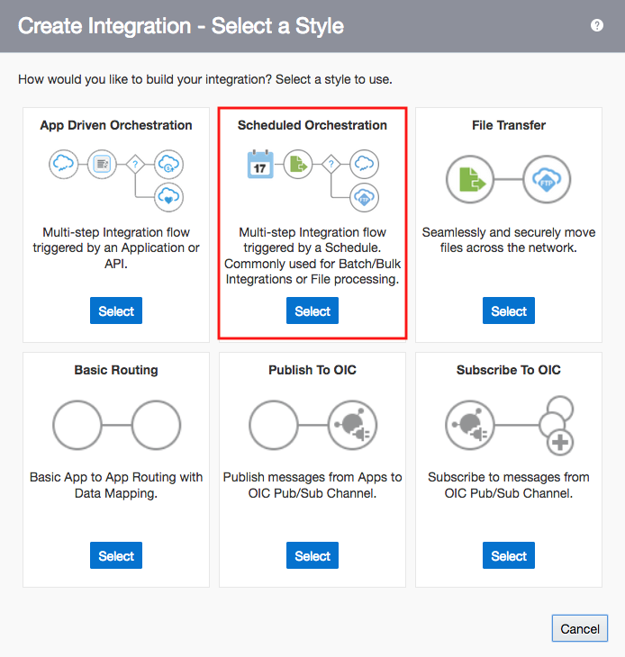
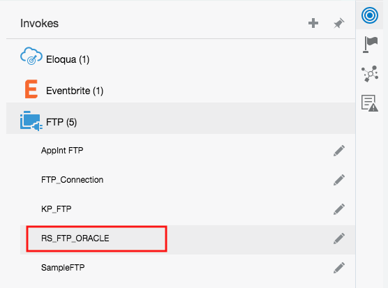
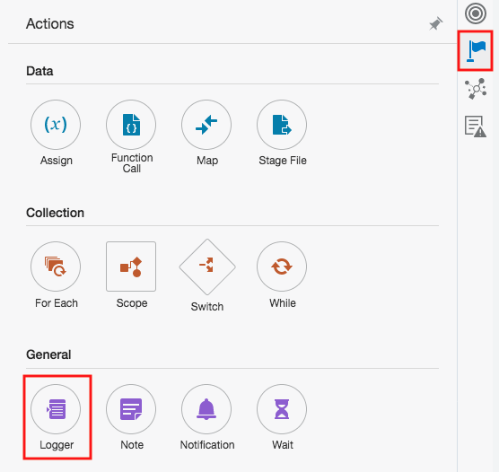
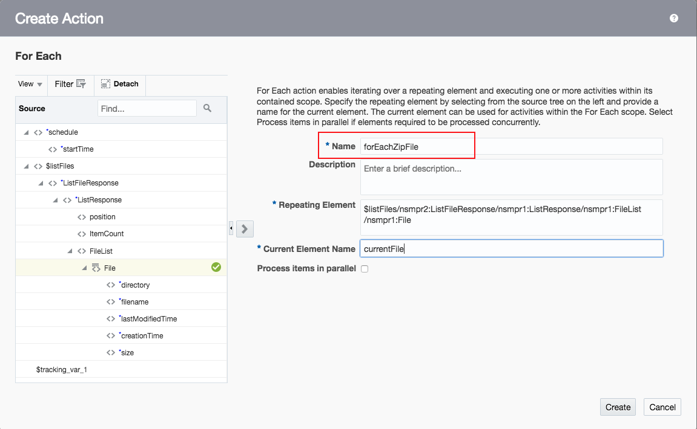
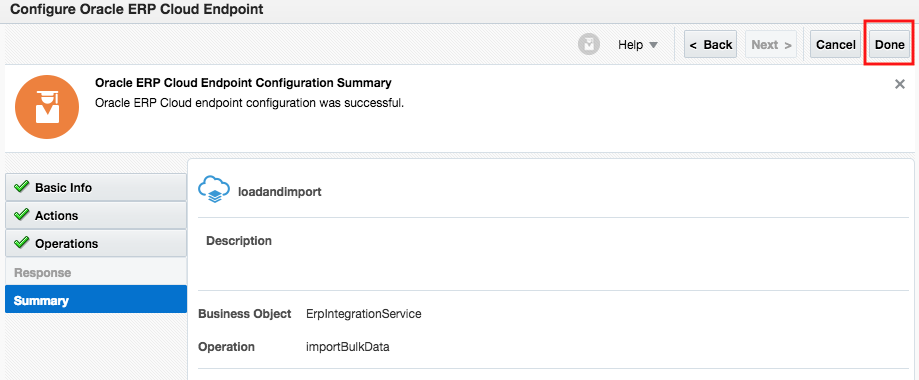
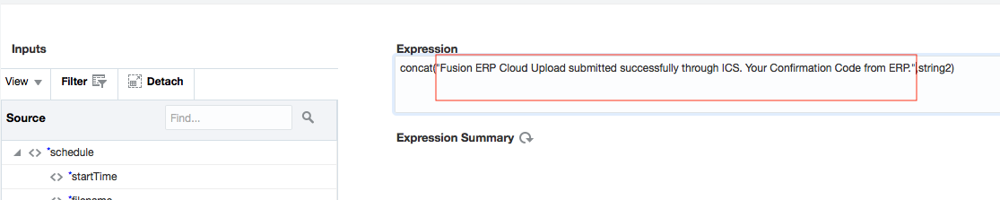
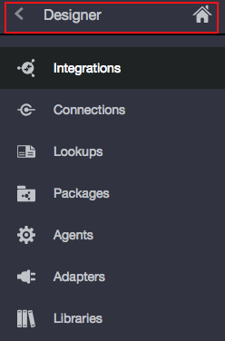
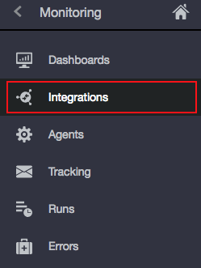
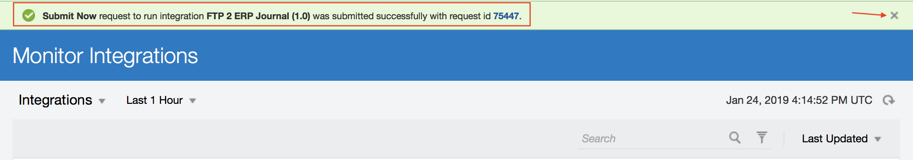

# Lab 600: FTP to Fusion ERP (Batch Processing)

## Objective

 In this lab, we are going to use Oracle Integration Cloud's Fusion FTP and ERP adapters to process a **_.csv_** file, and load its contents into Fusion ERP Cloud.

## Required Artifacts

- The following lab
- Oracle Public Cloud account that will be supplied by your instructor

## Prerequisites

- Complete Lab 300
- Create a connection for FTP Adapter 
- Create a connection for ERP Cloud Adapter

Let's start by logging into the Oracle Integration Cloud platform. 

## 1.1: Create Integration

#### 1.1.1: Go to the Oracle Integration Cloud home page

#### 1.1.2: Select **_Integrations_** from the left hand side menu

#### 1.1.3: Click the **_Create_** button located on the right top corner

#### 1.1.4: Select **_Scheduled Orchestration_** from the list of integration styles

#### 1.1.5: Enter required integration information

#### 1.1.6: Confirm that the integration was created successfully
You should get the following message once you create your integration. Close the message.

## 1.2: Configure the FTP Adapter Endpoint

#### 1.2.1: Click the circle icon to the right, and select **_FTP_** from the list under **_Invokes_**

#### 1.2.2: When the list expands, drag the FTP Adapter you created in Lab 300 on the grey arrow extending below the schedule adapter

You should see a blue plus sign appear on the arrow indicating where you should drop the FTP adapter.

#### 1.2.3: Indicate endpoint name and click **_Next_**

#### 1.2.4: Provide **_Selection Operation_**, **_Input Directory_**, **_File Name Pattern_**, **_Max Files_** and click **_Next_**

#### 1.2.5: Confirm the information you entered is correct in the **_Summary_** section, and click **_Done_**

**_NOTE_**: Delete the mapper that gets generated between the FTP adapter and the schedule adapter. Click on the mapper, select the hamburger menu, and choose **_Delete_**. There is nothing to map between these two adapters.

## 1.3: Configure a Switch Function

#### 1.3.1: Click on the flag icon to the right, and select the **_Switch_** function

#### 1.3.2: Drag and drop the **_Switch_** function on the plus sign icon below the FTP Adapter

#### 1.3.3: Select the **_Undefined_** expression and click on the pencil icon

#### 1.3.4: Select **_ItemCount_** from the **_Source_** field

#### 1.3.5: Drag and drop **_ItemCount_** onto the top expression field

#### 1.3.6: Select the greater than sign from the drop down menu

#### 1.3.7: Put the value **_0.0_** in the bottom expression field

#### 1.3.8: Validate the expression, and click **_Close_**.

**_NOTE_**: Save your integration.

## 1.4.1: Configure a Logger Action

#### 1.4.1: Click on the **_flag_** icon to the right and select the **_Logger_** action

#### 1.4.2: Drag and drop the **_Logger_** function after the otherwise expression on the integration flow

#### 1.4.3: Provide the **_Logger Action_** name and click **_Create_**

#### 1.4.4: Click on the pencil icon next to **_Logger Message_**

#### 1.4.5: Enter your expression in quotes in the expression box

#### 1.4.6: Validate the expression, and click **_Close_**

##### 1.4.7: Click **_close_** again

**_NOTE_**: Save your integration.

## 1.5: Configure a ForEach Function

#### 1.5.1 Click on the flag icon to the right, and select the **_ForEach_** function

#### 1.5.2: Drag and drop the **_ForEach_** function after the **_IF ItemCount > 0.0_** expression

#### 1.5.3: Enter **_Name_** 

#### 1.5.4: Drag and drop the **_File_** component under **_Source_** onto the **_Repeating Element_** field

#### 1.5.5: **_Provide Current Element Name_** and click **_Create_**

**_NOTE_**: Save your integration.

## 1.6: Configure a FTP Adapter that will Download the **_.csv_** File to Oracle Integration Cloud

#### 1.6.1: Click the circle icon from the right hand side menu and select FTP. Drag the FTP Adapter you created in Lab 300 after the **_forEach_** function

#### 1.6.2: Provide endpoint name and click **_Next_**

#### 1.6.4: Select the **_Operations_** to perform and define the parameters required and click **_Next_**

#### 1.6.5: Verify information under **_Summary_**, and click **_Done_**

#### 1.6.6: Configure the mapping for the FTP Adapter. Click on the **_downloadZip_** mapper and click on the pencil icon

#### 1.6.7: Drag and drop the **_Directory_** and **_Filename_** components from the **_Source_** field, to the **_Target_**

#### 1.6.8: Click **_validate_**, and **_Close_**

**_NOTE_**: Save your integration.

## 1.7: Configure a FTP Adapter That will Archive the Downloaded **_.csv_** File from Oracle Integration Cloud

#### 1.7.1: Click the circle icon from the right hand side menu and select **_FTP_**. Drag the FTP Adapter you created in Lab 300 after the **_downloadZiptoICS_** FTP adapter you configured above

#### 1.7.2: Enter adapter endpoint name and click **_Next_**

#### 1.7.3: Select the **_Operations_** to perform. Select **_Move a File_** from the Select Operation drop down menu, and Provide **_Target Directory Path_**. Click **_Next_**

#### 1.7.4: Confirm information under **_Summary_**, and click **_Done_**

#### 1.7.5: Select the mapper that got generated to the Left of the archive FTP Adapter. Click on the pencil icon

#### 1.7.6: Drag and drop the **_Directory_** and **_Filename_** components from the **_Source_** field, to the Target

#### 1.7.7: Double click on **_TargetDirectory_**

#### 1.7.8: Type the target directory path, click **_Save_**, then **_Close_**

#### 1.7.9: Double click on **_TargetFilename_**

#### 1.7.10: Expand the **_Mapping Components_** Field at the left bottom corner

#### 1.7.11: Under **_Functions_**, expand **_String_**, and select the **_concat_** function

#### 1.7.12: Drag and drop the **_concat_** function to the mapping Field

#### 1.7.13: Select the string1 text field, and drag and drop the **_Substring-Before_** function

#### 1.7.14: Expand the Source field 

#### 1.7.15: Drag and drop the **_filename_** component from **_Source_** onto string1 

**_NOTE_**: Before dragging, double click on string1, so that the text box field appears.

#### 1.7.16: Double click on sting2, and type in .zip in quotes

#### 1.7.17: Drag and drop the **_concat_** function from **_Mapping Components_** onto the last string2 text field

#### 1.7.18: Double click on **_string1_** and drag and drop the **_current-dateTime_** function 

#### 1.7.20: Click **_Save_** and **_Close_**

#### 1.7.21: Validate, and **_Close_**

**_NOTE_**: Save your integration.

## 1.8: Configure ERP Cloud Adapter

#### 1.8.1: Click on the circle icon on the right hand side menu. Select Oracle ERP Cloud, and choose the **_ERP Adapter_** you created in Lab 300

#### 1.8.2: Enter endpoint name and click **_Next_**

#### 1.8.3: Configure adapter actions and click **_Next_**

#### 1.8.4: Configure the Service and Operation as follows, and click **_Next_**

#### 1.8.5: Confirm information under **_Summary_**, and click **_Done_**

#### 1.8.6: Select the **_loadandimport_** mapper that got generated to the left of the ERP adapter, and click on the pencil icon

#### 1.8.7: Map the following components from the **_Source_** field on the left to the components on the target field

**_NOTE_**: Once mapping is done, make sure to validate before closing. Save your integration.

## 1.9: Configure Notification

#### 1.9.1: Select the flag icon to the right hand side menu. Select **_Notification_** under general

#### 1.9.2: Drag and drop the **_Notification_** function 

#### 1.9.3: Enter **_Name_**, and click **_Create_**

Close the message indicating that the Notification action Email was created successfully.

#### 1.9.4: Configure the **_From_** Field. Click on the pencil icon

#### 1.9.5: In the text box under **_Expression_**, hard code the email address for the From field. Click on the refresh icon to view **_Expression Summary_**.

#### 1.9.6: Validate expression, and **_Close_**

#### 1.9.7: Configure the **_To_** Field. Click on the pencil icon

#### 1.9.8: In the text box under Expression, hard code the email address for the To field. Click on the refresh icon to view **_Expression Summary_**.

#### 1.9.9: Validate expression, and **_Close_**

#### 1.9.10: Configure the **_Subject_** Field. Click on the pencil icon

#### 1.9.11: Select the **_concat_** function under components

#### 1.9.12: Drag and drop the **_concat_** function in the text box below Expression 

#### 1.9.13: Replace string1 with the following: "Fusion ERP Cloud upload submitted successfully through ICS. Your Confirmation Code from ERP". Keep the quotes, and the comma after.

#### 1.9.14: Remove string2. Drag the **_Result_** component from the source field, and drop it after the comma. 

#### 1.9.15: Validate Expression, and Close

#### 1.9.16: In the **_Body_** Field, type in 'No Body Required' 

#### 1.9.17: Validate Notification, and **_Close_**

## 1.10: Resolve Integration Error

#### 1.10.1: Click on the hamburger menu on the right, and select **_Tracking_**

#### 1.10.2: Drag and drop **_startTime_** from the source field, to the **_Tracking Field_**. Click **_save_**.

**_NOTE_**: Save your integration, and click close.

## 1.11: Activate Integration

#### 1.11.1: Locate your integration in the integration section under Designer

#### 1.11.2: Turn the activation switch to the right

#### 1.11.3: Select **_Enable Tracing_** and **_Including Payload_**. Click **_Activate_**

#### 1.11.4: Confirm that the integration is activated

## 1.12: Run Integration

#### 1.12.1: Click on the back arrow next to **_Designer_**

#### 1.12.2: Select **_Monitoring_**

#### 1.12.3: Select **_Integrations_**

#### 1.12.4: Click on the arrow icon to run the integration

#### 1.12.5: Confirm the integration run successfully.

#### 1.12.6: Select **_Tracking_** from the left hand side menu

#### 1.12.7: Click on the refresh icon to view your integration under Tracking

#### 1.12.8: Confirm your integration run is completed successfully. Click on the refresh icon again if your integration is still in progress.

You have now completed Lab 600 of the OIC SaaS Developer Workshop. In the next lab, we are going to use OIC Fusion ERP Adapter to listen to Fusion ERP events (i.e, Product Data Hub Item Creation etc.)

- This Lab is now completed.
