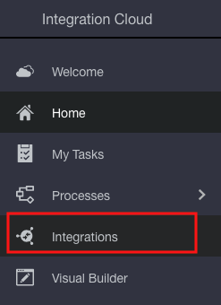
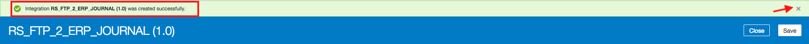
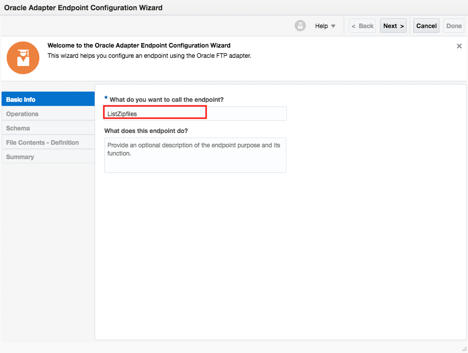
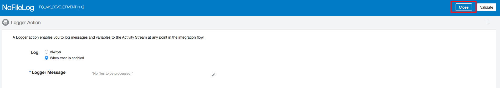
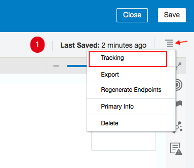

# Lab 600: FTP to Fusion ERP: Batch Processing 

## Objective

 In this lab, we are going to use Oracle Integration Cloud's Fusion FTP and ERP Adapters to process a **_.csv_** file, and load its contents into Fusion ERP Cloud.

## Required Artifacts

- The following lab
- Oracle Public Cloud account that will be supplied by your instructor

## Prerequisites 

- Complete Lab 300
- Create a connection for FTP Adapter 
- Create a connection for ERP Cloud Adapter

Let's start by logging into the Oracle Integration Cloud, and configuring an integration.

## 1.1: Configure Integration

#### 1.1.1: Go to the Oracle Integration Cloud home page

#### 1.1.2: Select **_Integrations_** from the left hand side menu

#### 1.1.3: Click on **_Create_** from the Right Top Corner

#### 1.1.4: Select **_Scheduled Orchestration_** 

#### 1.1.5: Enter Required Integration Information

You should get the following message once you create your integration. Close the message.

#### 1.1.6: Click on the Circle Icon on the Far Right, and Select FTP from the list under Invokes

#### 1.1.7: When the List Expands, Drag the FTP Adapter You Created onto the Grey Arrow Under the Schedule Adapter

You should see a blue plus sign icon appear on the arrow indicating where you should drop the FTP adapter.

#### 1.1.8: Configure the FTP Adapter Endpoint

###### 1.1.8.1: Indicate filename and Click **_Next_**

#### 1.1.8.2: Provide Selection Operation, Input Directory, File Name Pattern, Max Files and Click Next

#### 1.1.8.3: Confirm the information you entered is correct in the Summary section, and click **_Done_**

NOTE: Delete the Mapper Function that gets created. Click on the Mapper, select the hamburger menu, and choose Delete.

#### 1.1.9: Configure a Switch Function

##### 1.1.9.1: Click on the Flag Icon on the right, and Select the Switch Function

#### 1.1.9.2: Drag and Drop the Switch Function on the Plus Sign Icon Under Your FTP Adapter

#### 1.1.9.3: Select the Undefined Function and Click on the Pencil Icon

#### 1.1.9.4: Select **_ItemCount_** From the Menu Under Source

#### 1.1.9.5: Drag and Drop **_ItemCount_** onto the Top Expression Field

#### 1.1.9.6: Select the Greater than Sign from the Drop Down Menu

#### 1.1.9.7: Put the value **_0.0_** in the Bottom Expression Field

#### 1.1.9.8: Validate the Expression, and Click **_Close_**.

NOTE: Save Your Integration

#### 1.1.10: Configure a Logger Action

###### 1.1.10.1: Click on the Flag Icon on the Right and Select the Logger Action

###### 1.1.10.2: Drag and Drop the Logger Function After the Otherwise Expression

###### 1.1.10.3: Provide the Logger Action Name and Click Create

###### 1.1.10.4: Click on the Pencil Icon Next to **_Logger Message_**

###### 1.1.10.5: Enter Your Expression in Quotes in the Expression Box

###### 1.1.10.6: Validate the Expression, and Click Close

##### 1.1.10.7: Click Close Again

NOTE: Save Your Integration

#### 1.1.11: Configure a ForEach Function

###### 1.1.11.1 Click on the Flag Icon on the Right and Select the ForEach Function

###### 1.1.11.2 Drag and Drop the ForEach Function After the **_IF ItemCount > 0.0_** Expression

###### 1.1.11.3 Enter Name Information

###### 1.1.11.3 Drag and Drop the **_File_** Component Under Source onto the **_Repeating Element_** Field

###### 1.1.11.4 **_Provide Current Element Name_** and Click Create

###### 1.1.11.5 **_Provide Current Element Name_** and Click Create

NOTE: Save Your Integration

#### 1.1.12: Configure a FTP Adapter That Will Download the File to Oracle Integration Cloud

#### 1.1.12.1: Click the Circle Icon from the Right Hand Side menu and Select FTP. Drag the FTP Adapter You Created After the **_forEach_** Function

#### 1.1.12.2: Click the Circle Icon from the Right Hand Side menu and Select FTP. Drag the FTP Adapter You Created After the **_forEach_** Function

##### 1.1.12.3: Provide Name for the Endpoint and click **_Next_**

##### 1.1.12.4: Select the Operation to Perform and Define the Parameters Required and click **_Next_**

##### 1.1.12.5: Verify Information on the Summary Page, and click **_Done_**

##### 1.1.12.6: Configure the Mapping for the FTP Adapter. Click on the Mapper Function and Click on the Pencil Icon

##### 1.1.12.7: Drag and Drop the Directory and Filename Components from the Source field, to the Target

##### 1.1.12.8: Click Validate, and Close

NOTE: Save Your Integration

#### 1.1.13: Configure a FTP Adapter That will Archive the Downloaded File from Oracle Integration Cloud

##### 1.1.13.1: Click the Circle Icon from the Right Hand Side menu and Select FTP. Drag the FTP Adapter You Created After the FTP Adapter You Configured Above

##### 1.1.13.1: Enter Adapter Endpoint Name and Click **_Next_**

##### 1.1.13.2: Select the Operation to Perform and Define the Parameters Required. Select **_Move a File_** Under Select Operation, and Provide **_Target Directory Path_**. Click **_Next_**

##### 1.1.13.3: Confirm Information of Summary Page, and Click Done

##### 1.1.13.4: Select the Mapper that got Generated to the Left of the archive FTP Adapter. Click on the Pencil Icon

##### 1.1.12.7: Drag and Drop the Directory and Filename Components from the Source field, to the Target

##### 1.1.12.8: Double Click on **_TargetDirectory_**

##### 1.1.12.9: Type the Target Directory Path, Click **_Save_**, then **_Close_**

##### 1.1.12.8: Double Click on **_TargetFilename_**

##### 1.1.12.9: Expand the **_Mapping Components_** Field at the Left Bottom Corner

##### 1.1.12.10: Under Functions, Expand String, and Select the **_concat_** Function

##### 1.1.12.11: Drag and Drop the **_concat_** Function to the Mapping Field

##### 1.1.12.12: Select the String 1 Text Field, and Drag and Drop the Substring-Before Function

##### 1.1.12.13: Expand the Source Field 

#### #1.1.12.14: Drag and Drop the **_filename_** component from Source onto string 1 

NOTE: Before dragging, double click on string 1, so that the text box field appears.

##### 1.1.12.15: Double click on Sting 2, and type in .zip in quotes

##### 1.1.12.16: Drag and Drop the Concat Function from Mapping Components onto the last String 2 Text Field

##### 1.1.12.17: Double click on String 1 and Drag and Drop the **_current-dateTime_** Function 

##### 1.1.12.19: Click Save and Close

##### 1.1.12.20: Validate and Close

NOTE: Save Your Integration

#### 1.1.13: Configure ERP Adapter

##### 1.1.13.1: Click on the Circle Icon on the Right Hand Side Menu. Select Oracle ERP Cloud, and Choose the ERP Adapter You Created

##### 1.1.13.2: Enter Endpoint Name and click **_Next_**

##### 1.1.13.3: Configure Adapter Actions and Click **_Next_**

##### 1.1.13.4: Configure the Service and Operation as Follows, and Click **_Next_**

##### 1.1.13.5: Confirm information on Summary page, and Click **_Done_**

##### 1.1.13.6: Select the Mapper that got Generated to the Left of the ERP adapter, and Click on the Pencil Icon

##### 1.1.13.7: Map the Following Components from the Source Field on the Left to the Components on the Target Field

NOTE: Once mapping is done, make sure to validate before closing. Save Your Integration

#### 1.1.14: Configure Notification

##### 1.1.14.1: Select the Flag Icon on the Right Hand Side Menu. Select Notification Under General

##### 1.1.14.2: Drag and Drop the Notification Function 

##### 1.1.14.2: Enter Name, and Click **_Create_**

Close the message indicating that the Notification action Email was created successfully. 

##### 1.1.14.3: Configure the **_From_** Field. Click on the Pencil Icon

##### 1.1.14.4: In the text box under Expression, hard code the email address for the From field. Click on the refresh icon to view Expression Summary.

##### 1.1.14.5: Validate Expression, and Close

##### 1.1.14.6: Configure the **_To_** Field. Click on the Pencil Icon

##### 1.1.14.7: In the text box under Expression, hard code the email address for the To field. Click on the refresh icon to view Expression Summary.

##### 1.1.14.8: Validate Expression, and Close

##### 1.1.14.9: Configure the **_Subject_** Field. Click on the Pencil Icon

##### 1.1.14.10: Select the **_concat_** function from under components

##### 1.1.14.11: Drag and drop the **_concat_** function in the text box below Expression 

##### 1.1.14.12: Replace string1 with "Fusion ERP Cloud Upload submitted successfully through ICS. Your Confirmation Code from ERP." Keep the quotes, and the comma after.

##### 1.1.14.13: Remove string2. Drag the Result Component from the source field, and Drop it after the comma. 

##### 1.1.14.14: Validate Expression, and Close

##### 1.1.14.15: In the **_Body_** Field, type in 'No Body Required' 

##### 1.1.14.15: Validate Notification, and Close

#### 1.1.15: Resolve Integration Error

#### 1.1.15.1: Click on the hamburger menu on the right, and select **_Tracking_**

#### 1.1.15.1: Drag and drop **_startTime_** from the source field, to the Tracking Field. Click save.

NOTE: Save Your Integration, and click close.

#### 1.1.16: Activate Integration

#### 1.1.16.1: Locate your integration in the integration section under Designer

#### 1.1.16.2: Turn the activation switch to the right

#### 1.1.16.2: Select **_Enable Tracing_** and **_Including Payload_**. Click **_Activate_**

#### 1.1.16.3: Confirm integration is activated

#### 1.1.17: Run Integration

#### 1.1.17.1: Click on the back arrow next to **_Designer_**

#### 1.1.17.2: Select **_Monitoring_**

#### 1.1.17.3: Select **_Integrations_**

#### 1.1.17.4: Click on the arrow icon to run the integration

#### 1.1.17.5: Confirm the integration run successfully.

#### 1.1.17.6: Select **_Tracking_** from the left hand side menu

#### 1.1.17.7: Click on the refresh icon to view your integration under Tracking

#### 1.1.17.8: Confirm your integration run is completed successfully. Click on the refresh icon again if your integration is still in progress.

You have now completed Lab 600 of the OIC SaaS Developer Workshop. In the next lab, we are going to use OIC Fusion ERP Adapter to listen to Fusion ERP events (i.e, Product Data Hub Item Creation etc.)

- This Lab is now completed.

