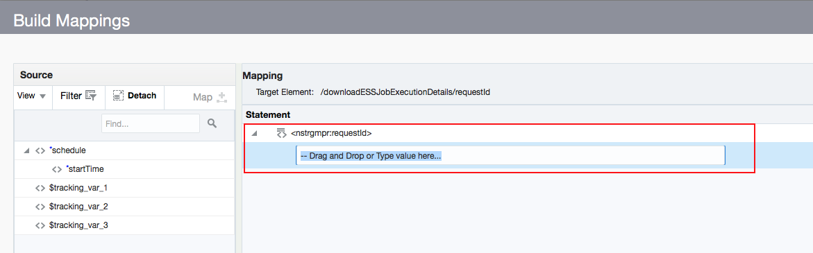
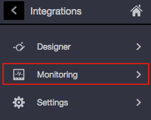
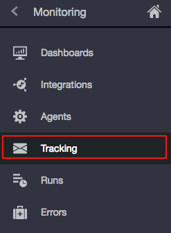

# Lab 700: Fusion ERP (Events – PDH, Purchase Order) – Data Synchronization

## Objective

In this Lab we are going to use OIC Fusion ERP Adapter to listen to Fusion ERP events (i.e, Product Data Hub Item Creation etc.). The Integration flow will process the events and place them into a File.O

## Required Artifacts

- The following lab
- Oracle Public Cloud account that will be supplied by your instructor

## 1.1: Create an Invoice

Let's start by logging into the Oracle ERP Cloud Platform.

#### 1.2: Click on the navigation arrow on the top right until you find **_Payables_**

#### 1.3: Click on **_Payables_**, and select **_Invoices_**

#### 1.4: Click on the hamburger menu to the right

#### 1.5: Select **_Create Invoice_**

#### 1.6: Enter the following attributes. Make sure you insert a text in the **_Number_** field 

#### 1.7: Click **_Invoice Actions_** and select **_calculate Tax_** from the menu

#### 1.8: Change the amount you entered to equal the total amount that includes the tax amount

#### 1.9: Confirm the amount includes the tax amount 

#### 1.10: Click **_Invoice Actions_** and select **_Validate_** 

#### 1.11: Confirm the status shows **_Validated_**

#### 1.12: Click **_Invoice Actions_** and select **_Pay in Full_**

#### 1.13: Fill out the appropriate fields as follows

#### 1.14: Confirm that the invoice has been created

#### 1.15: Save and Close

#### 1.16: Click on **_Payments_** from the homepage menu

#### 1.17: Copy the **_Process ID_** that got generated for your invoice, and save it for later retrieval
Now, let's create the integration that will download the invoice from ERP to an FTP Server.

Start by logging into the Integration Cloud platform.

## 1.1: Create Integration

#### 1.1.1: Go to the Oracle Integration Cloud home page

#### 1.1.2: Select **_Integrations_** from the left hand side menu

#### 1.1.3: Click the **_Create_** button located on the right top corner

#### 1.1.4: Select **_Scheduled Orchestration_** from the list of integration styles

#### 1.1.5: Enter required integration information

#### 1.1.6: Confirm that the integration was created successfully
You should get the following message once you create your integration. Close the message.

**_NOTE_**: Save your integration.

## 1.2: Configure the ERP Cloud Adapter Endpoint that will Download the Payment

#### 1.2.1: Click the circle icon to the right, and select **_Oracle ERP Cloud_** from the list under **_Invokes_**

#### 1.2.2: When the list expands, drag the ERP Adapter you created in Lab 300 on the grey arrow extending below the schedule adapter

You should see a blue plus sign appear on the arrow indicating where you should drop the ERP adapter.

#### 1.2.3: Indicate endpoint name and click **_Next_**

#### 1.2.4: Configure **_Actions_**

#### 1.2.6: Configure **_Operations_**

#### 1.2.7: Confirm that the information you entered is correct in the **_Summary_** section, and click **_Done_**

**_NOTE_**: Save your integration.

## 1.2: Configure Mapper to Download Payment

#### 1.2.1: Select the **_paymentDownload_** mapper that got generated. Click on the pencil icon

#### 1.2.2: Double click on **_requestiId_**

#### 1.2.3: Select the text field

#### 1.2.4: Hardcode the process Id retrieved from ERP Cloud after generating an invoice

#### 1.2.5: Click save, and close

#### 1.2.6: Validate the mapping, and close

**_NOTE_**: Save your integration.

## 1.3: Configure a FTP Adapter that will Download the Invoice to a FTP Server 

#### 1.3.1: Click the circle icon from the right hand side menu and select **_FTP_**. Drag the FTP Adapter you created in Lab 300 after the **_paymentDownload_** ERP adapter you configured above

#### 1.3.2: Indicate endpoint name and click **_Next_**

#### 1.3.3: Configure **_Operations_**

#### 1.3.4: Configure **_Schema_**. Upload an XML schema

#### 1.3.5: Configure **_File Contents_**

#### 1.3.6: Confirm that the information you entered is correct in the **_Summary_** section, and click **_Done_**

**_NOTE_**: Save your integration.

## 1.4: Configure mapping Between ERP and FTP Adapter

#### 1.4.1: Select the **_downloadFile_** mapper and click on the pencil icon

#### 1.4.2: Drag and drop **_Content_** onto **_opaqueElement_**

#### 1.4.3: Validate, and close

## 1.5: Resolve Integration Error

#### 1.5.1: Click on the hamburger menu on the right, and select **_Tracking_**

#### 1.5.3: Drag and drop **_startTime_** from the source field, to the **_Tracking Field_**. Click **_save_**.

**_NOTE_**: Save your integration, and click close.

## 1.6: Activate Integration

#### 1.6.1: Locate your integration in the integration section under Designer

#### 1.6.2: Turn the activation switch to the right

#### 1.6.3: Select **_Enable Tracing_** and **_Including Payload_**. Click **_Activate_**

#### 1.6.4: Confirm that the integration is activated

## 1.7: Run Integration

#### 1.7.1: Click on the back arrow next to **_Designer_**

#### 1.7.2: Select **_Monitoring_**

#### 1.7.3: Select **_Integrations_**

#### 1.7.4: Click on the arrow icon to run the integration

#### 1.7.5: Confirm the integration run successfully.

#### 1.7.6: Select **_Tracking_** from the left hand side menu

#### 1.7.7: Click on the refresh icon to view your integration under Tracking

#### 1.7.8: Confirm your integration run is completed successfully. Click on the refresh icon again if your integration is still in progress.

You have now completed Lab 700 of the OIC SaaS Developer Workshop. In the next lab, we are going to download and implement a recipe from Oracle Integration Cloud Marketplace.
- This Lab is now completed.

