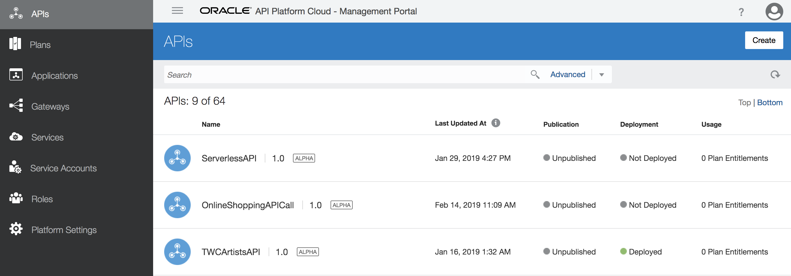

# Lab 900: Security - Enterprise API Governance"

## Introduction

In this lab, we are going to add an existing Fusion SaaS REST API to API Platform Cloud Service and secure the API with policies.

## Objectives
The purpose of this lab is to use API Platform Cloud to show how you can secure your APIs.

## Required Artifacts

- The following lab
- Oracle Public Cloud account that will be supplied by your instructor

Let's start by logging into the API Platform Cloud Management Portal.
 

You have now completed Lab 900 of the AIC SaaS Developer Workshop. 

- This Lab is now completed.

