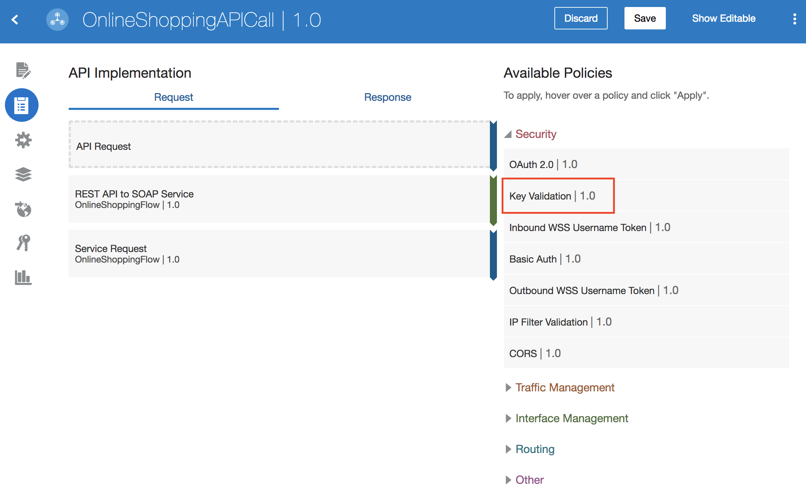
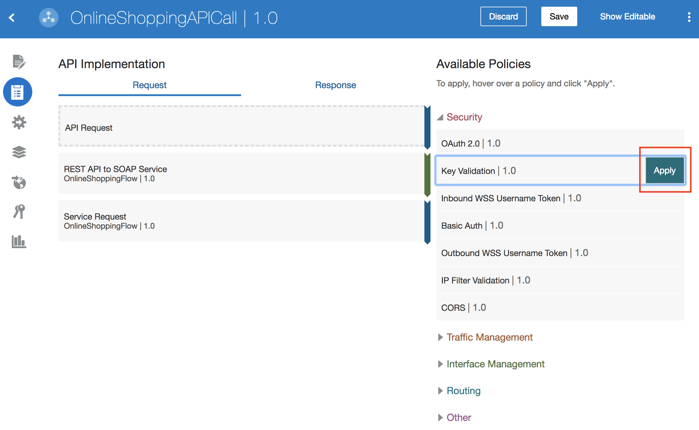
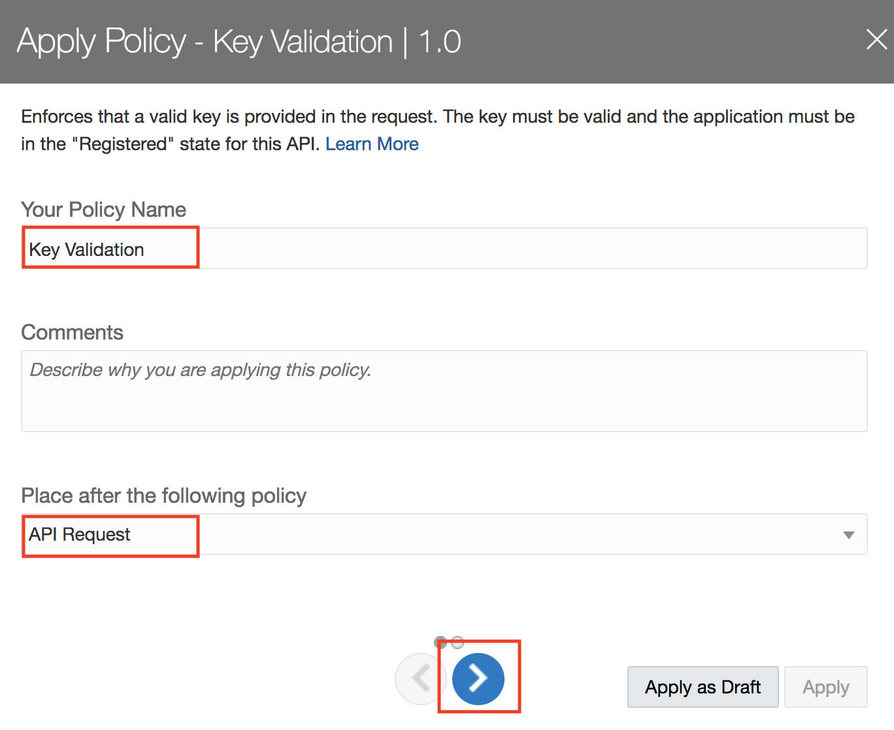
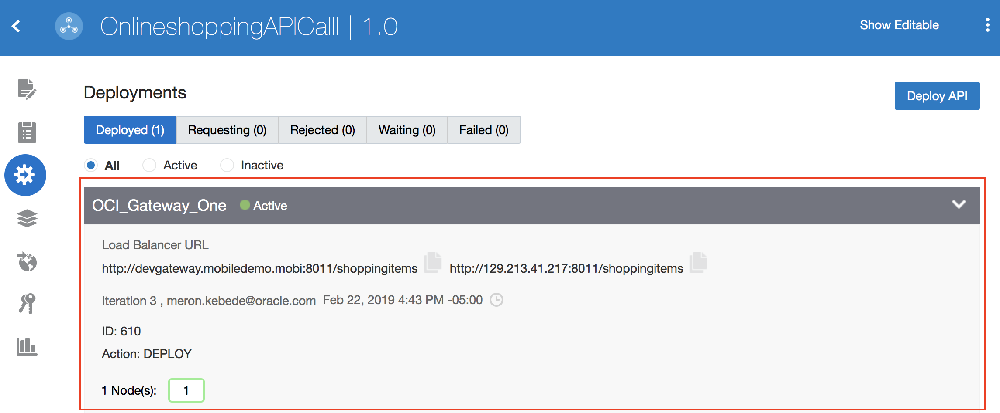

# Lab 900: Security - Enterprise API Governance

## Introduction

In this lab, we are going to add an existing Fusion SaaS REST API to API Platform Cloud Service and secure the API with policies.

## Objectives
The purpose of this lab is to use API Platform Cloud to show how you can secure your APIs.

## Required Artifacts

- The following lab
- Oracle Public Cloud account that will be supplied by your instructor

Let's start by logging into the API Platform Cloud Management Portal.

 

## 1.1: Create API

#### 1.1.1: Click on **_Create_** from the right top menu

#### 1.1.2: Enter **_Name_**, **_Version_**, and click **_create_**

## 1.2: Configure API Request

#### 1.2.1: From the APIs tab, click the **_OnlineshoppingAPICall_** API you created in the previous task

#### 1.2.1: From the APIs tab, click the **_OnlineshoppingAPICall_** API you created in the previous task

#### 1.2.2: Click on the API Implementation icon

#### 1.2.3: Click on API Request, and click the **_Edit_** button

#### 1.2.4: Select **_HTTP_** from the **_protocol_** list, and enter an endpoint, and click **_apply_**

## 1.3: Configure Service Request

#### 1.3.1: Click on Service Request, and click the **_Edit_** button

#### 1.3.2: Enter an Apiary Mock Service URL in **_Enter a URL_**, and click **_Apply_**

#### 1.3.3: Click **_Save_**

## 1.4: Configure Security

#### 1.4.1: Under APIs, select the API you have created

#### 1.4.2: Select the **_API Implementation_** icon from the icon list on the left

#### 1.4.3: Click on **_Security_** to expand it 

#### 1.4.4: Select **_Key Validation_**

#### 1.4.5: Click on **_Apply_**

#### 1.4.6:  Complete the required fields on the first page, and click the next button

#### 1.4.7: Provide a **_Key Query Parameter_**, and click **_Apply_**

#### 1.4.8: Click on **_Save_**

#### 1.4.9: Confirm that the security configuration is saved

#### 1.4.10: Additional resources on available security policies

- [Refer to policy details here](https://docs.oracle.com/en/cloud/paas/api-platform-cloud/apfad/implement-apis.html#GUID-1EE65B88-5050-4AFE-8F53-4B256D4E2AA3)

## 1.5 Deploy API to Gateway

#### 1.5.1: Click on the **_Deployments_** icon

#### 1.5.2: Click on **_Deploy API_**

#### 1.5.3: Select the checkbox of the gateway you want to deploy your API to, and click **_Deploy_**

NOTE: you should receive a notification that your deployment request has been submitted.

#### 1.5.4: Confirm that the API has been deployed

## 1.4: Login to Developers Portal

You have now completed Lab 900 of the Oracle Integration Cloud SaaS Developer Workshop.

- This ab is now completed.

