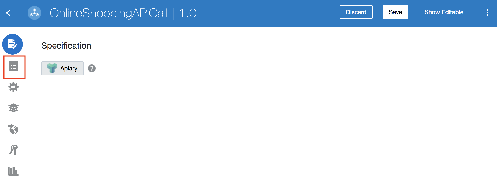
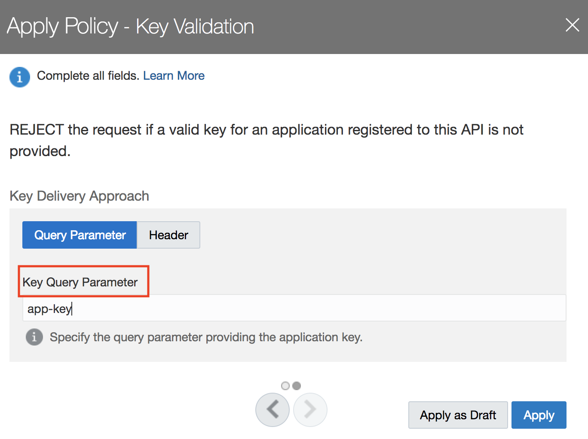
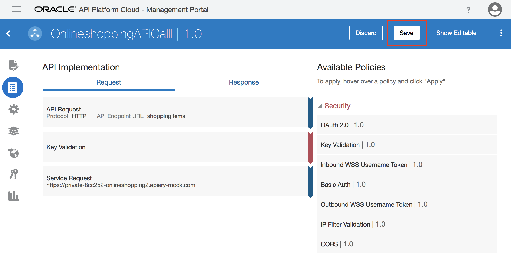

# Lab 900: Security - Enterprise API Governance

## Introduction

In this lab, we are going to add an existing Fusion SaaS REST API to API Platform Cloud Service and secure the API with policies.

## Objectives
The purpose of this lab is to use API Platform Cloud to show how you can secure your APIs.

## Required Artifacts

- The following lab
- Oracle Public Cloud account that will be supplied by your instructor

Let's start by logging into the API Platform Cloud Management Portal.

 

## 1.1 Configure Security

#### 1.1.1 Under APIs, select the API you have created

#### 1.1.2 Select the **_API Implementation_** icon from the icon list on the left

#### 1.1.3 Click on **_Security_** to expand it 

#### 1.1.4 Select **_Key Validation_**

#### 1.1.5 Click on **_Apply_**

#### 1.1.6  Complete the required fields on the first page, and click the next button

#### 1.1.7 Provide a **_Key Query Parameter_**, and click **_Apply_**

#### 1.1.8 Click on **_Save_**

#### 1.1.9 Confirm that the security configuration is saved

#### 1.1.10 Additional resources on available security policies

- [Refer to policy details here](https://docs.oracle.com/en/cloud/paas/api-platform-cloud/apfad/implement-apis.html#GUID-1EE65B88-5050-4AFE-8F53-4B256D4E2AA3)

You have now completed Lab 900 of the Oracle Integration Cloud SaaS Developer Workshop.

- This ab is now completed.

