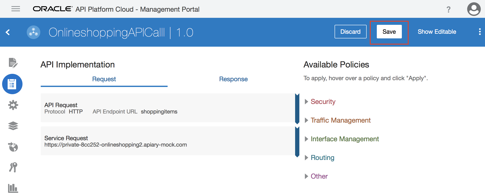
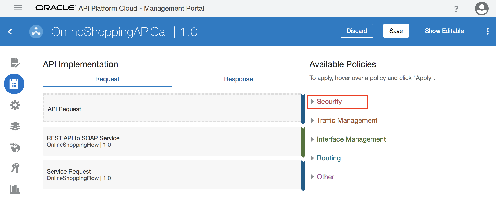
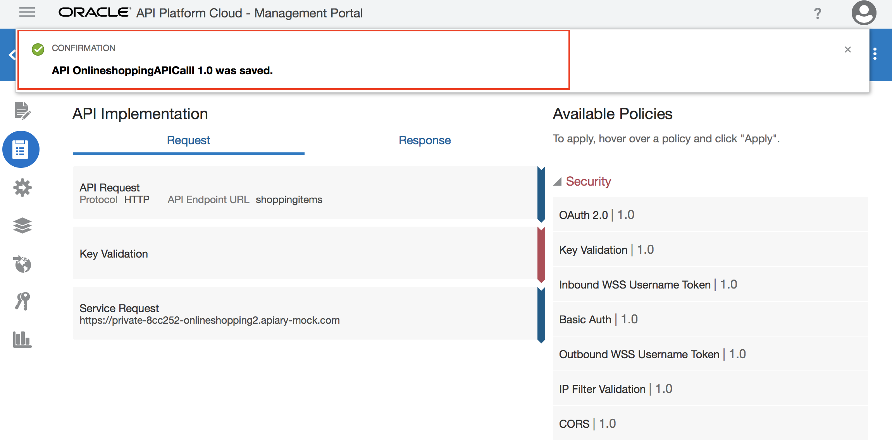
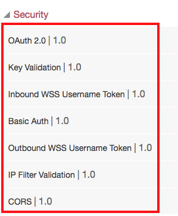

# Lab 900: Security - Enterprise API Governance

## Introduction

In this lab, we are going to add an existing REST API generated in Apiary to API Platform Cloud Service and secure the API with policies.

## Objectives
The purpose of this lab is to use API Platform Cloud to show how you can secure your APIs.

## Required Artifacts

- The following lab
- Oracle Public Cloud account that will be supplied by your instructor

Let's start by logging into the API Platform Cloud Management Portal.

## 1.1: Create API

#### 1.1.1: Click on **_Create_** from the right top menu

#### 1.1.2: Enter **_Name_**, **_Version_**, and click **_Create_**

## 1.2: Configure API Specification

#### 1.2.1: From the APIs tab, click the **_OnlineshoppingAPICall_** API you created in the previous task

#### 1.2.2: Select the **_Specification_** icon, and click on **_Apiary_** 

#### 1.2.3: Select the API you've created, and click **_Connect_**
NOTE: If you don't have an API created in Apiary, go ahead and create one.

#### 1.2.4: Confirm connection

#### 1.2.5: Make sure you save

## 1.3: Configure API Request

#### 1.3.1: Click on the API Implementation icon

#### 1.3.2: Click on API Request, and click the **_Edit_** button

#### 1.3.3: Select **_HTTP_** from the **_protocol_** list, and enter an endpoint, and click **_apply_**

## 1.4: Configure Service Request

#### 1.4.1: Click on Service Request, and click the **_Edit_** button

#### 1.4.2: Enter an Apiary Mock Service URL in **_Enter a URL_**, and click **_Apply_**
NOTE: Enter everything until the .com

#### 1.4.3: Click **_Save_**

## 1.5: Configure Security

#### 1.5.1: While in the **_API Implementation_** section, click on **_Security_** from the available policies 

#### 1.5.2: Select **_Key Validation_**

#### 1.5.3: Click on **_Apply_**

#### 1.5.4:  Complete the required fields on the first page, and click the next button

#### 1.5.5: Provide a **_Key Query Parameter_**, and click **_Apply_**

#### 1.5.6: Click on **_Save_**

#### 1.5.7: Confirm that the security configuration is saved

#### 1.5.8: Below are additional resources on available security policies

- [Refer to policy details here](https://docs.oracle.com/en/cloud/paas/api-platform-cloud/apfad/implement-apis.html#GUID-1EE65B88-5050-4AFE-8F53-4B256D4E2AA3)

## 1.6: Deploy API to Gateway

#### 1.6.1: Click on the **_Deployments_** icon

#### 1.6.2: Click on **_Deploy API_**

#### 1.6.3: Select the checkbox of the gateway you want to deploy your API to, and click **_Deploy_**

NOTE: you should receive a notification that your deployment request has been submitted.

#### 1.6.4: Confirm that the API has been deployed

## 1.7: Configure Entitlements

#### 1.7.1: Click on **_Add Entitlement_**

#### 1.7.2: Select a plan, and click **_Add_**

#### 1.7.3: Click on your plan and select **_Published_**

#### 1.7.4: Select **_Yes_** to publish the entitlement

#### 1.7.5: Confirm that the API is published

## 1.8: Configure Publication

#### 1.8.1: Enter Portal Name, and click **_Save_**. Portal name is the same as 

#### 1.8.2: Click **_Publish to Portal_**

#### 1.8.3: Confirm that you have an API Portal URL generated

## 1.9: Log into the Developer Portal

#### 1.9.1: Use the same login credentials you used to log into the Management Portal

## 1.10: Register an Application

#### 1.10.1: Click the **_My Applications_** icon at the top right of the UI

#### 1.10.2: Click on **_Register Application_**

#### 1.10.3: Enter **_Application Name_**. Select an application type from the **_Application Type_** list. Enter **_Contact Information_** and **_Save_**.

#### 1.10.4: Click on the application you just registered

#### 1.10.5: Highlight and copy the application key. Paste it in a notepad for later use

## 1.11: Subscribe Application to an API

#### 1.11.1: Click on the **_APIs_** icon 

#### 1.11.2: Click on the API you have created

#### 1.11.3: Click on the **_Plans_** icon

#### 1.11.4: click on **_Subscribe_**

#### 1.11.5: Choose an application from the selected Plan, and click **_Subscribe_**

#### 1.11.6: Confirm that your application is listed under **_Subscribed Application_**

You have now completed Lab 900 of the Oracle Integration Cloud SaaS Developer Workshop.

- This lab is now completed.

